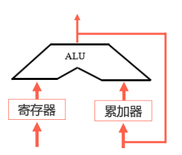
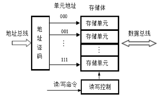
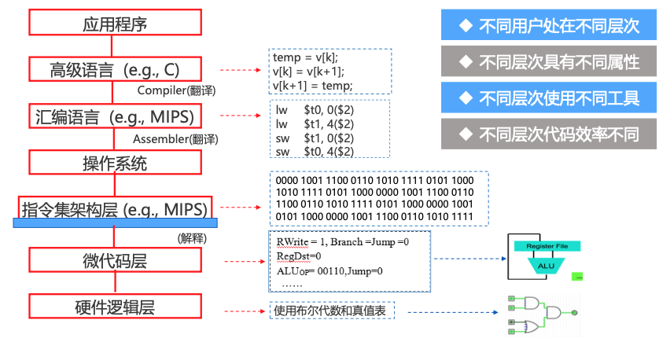
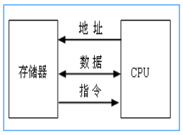
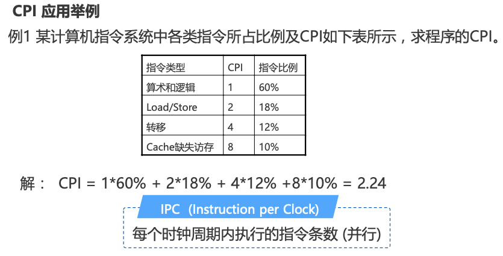

[华中科大(计算机组成原理)](https://www.icourse163.org/course/HUST-1003159001)

- [概论](#概论)
    - [1.冯诺依曼结构原理及层次结构分析](#1冯诺依曼结构原理及层次结构分析)
        - [1.1 冯诺依曼](#11-冯诺依曼)
        - [1.2 冯诺依曼计算机的工作原理](#12-冯诺依曼计算机的工作原理)
        - [1.3 冯诺依曼计算机的组成](#13-冯诺依曼计算机的组成)
        - [1.4 计算机的层次结构](#14-计算机的层次结构)
    - [2.计算机系统性能评价](#2计算机系统性能评价)
        - [2.1 非时间指标](#21-非时间指标)
        - [2.2 时间指标](#22-时间指标)
    - [3.计算机性能测试](#3计算机性能测试)
        - [3.1 测试的基本原理](#31-测试的基本原理)
        - [3.2 CPU测试工具](#32-CPU测试工具)
        - [3.3 显卡测试工具](#33-显卡测试工具)
        - [3.4 磁盘测试工具](#34-磁盘测试工具)
        - [3.5 内存测试工具](#35-内存测试工具)

------

# 概论

## 1.冯诺依曼结构原理及层次结构分析

### 1.1 冯诺依曼

[冯诺依曼](https://baike.baidu.com/link?url=8BAinjRdmAa1HgUNtx2yUkYNb20swvaD0F8AakMzbVSa-ynsdTLgdaUsfUMYrz7m8BgJ6UIB0yXruCOUA5mcDwH2yXnVZEX36GesP_BllopCSrfk8FS6Nl1Qyhb4yXpSvOfh_KI4xEAl9fz1uky3DFW7NpYrRMIYkKSC0lZGtEi)是20世纪最重要的数学教之一，被誉为计算机之父，因其在现代计算机、博弈论等领域的重大贡献成为美国科学院院士

### 1.2 冯诺依曼计算机的工作原理

**存储程序**：将程序存放在计算机的存储器中——存储程序构建与快速访问

**程序控制**：按指令地址访问存储器并取出指令，经译码依次产生指令执行所需的控制信号，实现对计算的控制，完成指令的功能——指令系统、控制器设计等

### 1.3 冯诺依曼计算机的组成

#### 硬件系统

-   主机：CPU（运算器+控制器）、内存
-   外设：输入/输出设备、外存储器
-   总线：地址线、数据线、控制线

##### 运算器

-   **算术运算**：加、减、乘、 除法等
-   **逻辑运算**：与、或、非、 移位等
-   **基本结构**：ALU (**A**rithmetic **L**ogical **U**nit) 、寄存 器、连接通路

##### 控制器

-   **基本功能**：产生指令执行过程所需要的所有控制信号，控制相关功能部件执行相应操作;
-   **控制信号的形式**：电平信号、 脉冲信号;
-   **产生控制信号的依据**： 指令、状态、 时序;
-   **控制信号的产生 方式**：微程序、 硬布线。

##### 存储器

-   **功能**：存储原程序、原数据、运算中间结果;
-   **工作模式**：读/写;
-   **工作原理**：按地址访问， 读/写数据。

##### 输入输出设备

-   **输入设备**：向计算机输入数据(键盘、鼠标、网卡、扫描仪等)
-   **输出设备**：输出处理结果(显示器、声卡、网卡、打印机等)

#### 软件系统

##### 对软件的理解

-   可运行的思想和内容的数字化

    思想：算法、规律、方法——程序表达

    内容：图形、图像、数据、声音、文字等被处理的对象

-   软件的表现形式：程序和数据（以二进制表示的信息）

-   软件的核心：算法

##### 软件的分类

-   系统软件：如操作系统、网络系统和编译系统
-   支持软件：如开发工具、界面工具等
-   应用软件：如字处理软件、游戏软件等

#### 硬件与软件系统间的关系

1. 相互依存：硬件是软件运行的基础，软件的正常运行时硬件发挥作用的重要途径。计算机系统必须要配备完善的软件系统才能正常工作，且应充分发挥其硬件的功能。
2. 逻辑等效性：某些功能即可由硬件来实现，也可由软件来实现
3. 协同发展：软件随硬件技术的迅速发展而发展，而软件的不断发展与完善又促进硬件的更新，两者密切地交织发展，缺一不可

### 1.4 计算机的层次结构

-   透明性概念：本来存在的事物或属性，从某个角度看，却好像不存在，如硬件的特性对C语言程序设计者而言就具有透明性
-   系统观：当硬件结构发生变化时要想到可能对软件产生的影响，不同类型的软件对硬件有不同的要求，编程的CPU硬件相关性，编程查阅对应CPU的编程手册
-   软硬件的分界线：即软硬件的接口，是指令操作硬件的接口，指令格式及指令的设计与硬件关联

## 2.计算机系统性能评价

### 2.1 非时间指标

1. 机器字长：指机器一次能处理的二进制位数

    

    -   由加法器、寄存器的位数决定;
    -   一般与内部寄存器的位数相等(字长);
    -   字长越长，表示数据的范围就越大，精确度越高;
    -   目前常见的有32位和64位字长

2. 总线宽度：数据总线一次能并行传输的最大信息位数

    

3. 主存容量与存储带宽

    主存容量：指一台计算机主存所包含的存储单元总数

    存储带宽：指单位时间内与主存交换的二进制信息量，常用单位B/s（字节/秒）。（影响存储带宽的指标包括数据位宽和数据传输速率）

### 2.2 时间指标

1. 主频f/时钟周期T，外频、倍频

    - 主频：指CPU内核工作的时钟频率，即CPU内数字脉冲信号震荡的速率，与CPU实际的运算能力之间不是唯一的、直接关系
    - 时钟周期T：也称节拍周期，是计算机中最基本的、最小的时间单位。在一个时钟周期内，CPU仅完成一个最基本的动作
    - f与T的关系：互为倒数，f越高，T就越小（f=100MHz时T=10ns，f=1GHz时T=1ns）。
    - 外频：指CPU（内存）与主板之间同步的时钟频率
    - 倍频：CPU主频与外频之间的倍数
    - 主频 = 外频 x 倍频

2. CPI（Clock cycles Per Instruction）

    - 执行一条指令（平均）需要的时钟周期数（即T周期的个数）

    - 单条指令CPI、一段程序中所有指令的CPI、指令系统的CPI等

    - CPI = 程序中所有指令的时钟周期数之和 / 程序中指令总数 = ∑（程序中各类指令的CPI x 程序中该类指令的比例）

        

3. MIPS（Million Instruction Per Second）

    

    

4. CPU时间

    

    

    CPU时间的计算方法

    

## 3.计算机性能测试

### 3.1 测试的基本原理

1. 计算机系统中配置大量的传感器和寄存器，系统运行的相关参数保存在相应的寄存器中
2. 测试程序通过读取相应寄存器的值得到系统运行的状况
3. 通过图形/数据方式显示获取的状态数值

### 3.2 CPU测试工具

- [CPUmark：](https://www.passmark.com/)综合CPU测试，包括系统存储，浮点运算和逻辑运算
- [SysID：](https://www.ibm.com/docs/en/zos/2.1.0?topic=statements-sysid)测试CPU电压，运行频率，L1、L2 Cache以及各项技术资料
- [Hot Cpu Tester：](https://hot-cpu-tester.en.softonic.com/)可测试机器稳定性，尤其是超频后的稳定性，找出CPU的最高超频点或缺陷，还可检测CPU的详细性能指标并给出量化的分数值。包括【复杂矩阵】、【排序算法】、【快速傅立叶变换】【CPU缓存】、【内存】、【硬盘】及指令集等。另外其CPU/Mem Burn-in还可以作为新购机时的烤机软件来使用

### 3.3 显卡测试工具

- [3DMark：](https://www.3dmark.com/)除衡量显卡性能外，已渐渐转变成一款衡量整机性能的软件，已发行3DMark99、3DMark11和The new 3DMark等近10哥版本
- N-Bench2：重点测试CPU以及系统图形性能
- FurMark：通过皮毛渲染算法来衡量显卡的性能及其稳定性，提供了全屏/窗口、预定分辨率、基于时间或帧的测试、多种多重采样反锯齿、竞赛等多种模式

### 3.4 磁盘测试工具

- Hard Disk Speed： 硬盘测速软件
- Disk Benchmark：通过对不同大小的数据库对磁盘读/写速度的影响检测硬盘、u盘、存储卡及其它可移动磁盘的读/写速率
- iometer：可被配置为基准测试程序的磁盘和网络I/O的负载，可测试磁盘和网络控制器的性能、总线带宽和时延等参数
- HDD Temperature Pro：硬盘温度探测软件

### 3.5 内存测试工具

- CTSPD：选择主板厂商及型号后可详细测试内存的信息，包括：CASIatency（列地址选通时延）、RAS to CAS delay（RAS到CAS的相对延迟时间）、RAS precharge Trp（RAS预充电时间）、DIMM内存生产厂商和DIMM编号等信息
- Memory Speed：通过读写不同大小的块数据来测试内存的性能
- Memory Transfer Timing Utility：通过对源文件和目标文件进行校正和非校正复制，测试内存的读、写速率