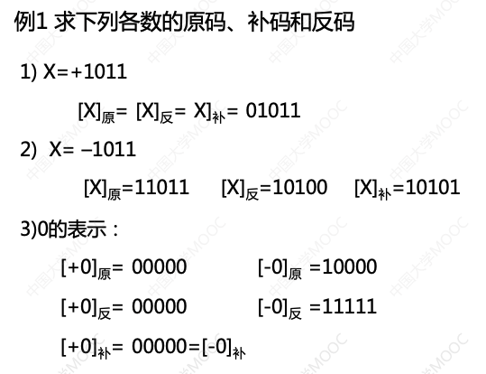
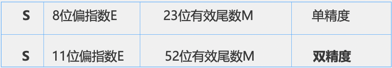

[华中科大(计算机组成原理)](https://www.icourse163.org/course/HUST-1003159001)

- [第二章 数据表示](#第二章-数据表示)

------

# 第二章 数据表示

## 2.1 机器数及其特点

### 2.1.1 为什么研究机器内的数据表示

**目的**：组织数据，方便计算机硬件直接使用

**要考虑的因素**：

支持的数据类型、 能表示的数据范围、能表示的数据精度、存储和处理的代价、是否有利于软件的移植等

### 2.1.2 机器内的数据表示

**真值**：符号用`+`、`-`表示的数据表示方法

**机器数**：用符号值化的数据表示方法，用`0`、`1`表示符号

### 2.1.3 常见的机器数

设定点数的形式为
$$
[x]_原=\begin{cases}
x\quad\quad\quad\ 0≤x<2^n\\
2^n-x\quad2^{-n}≤x<0
\end{cases}
$$

$$
[x]_反=\begin{cases}
x\quad\quad\quad\quad\quad\quad 0≤x<2^n\\
2^{n+1}+x-1\quad2^{-n}≤x<0
\end{cases}
$$

$$
[x]_补=\begin{cases}
x\quad\quad\quad\ 0≤x<2^n\\
2^{n+1}+x\quad2^{-n}≤x<0
\end{cases}
\quad mod\ 2^{n+1}
$$

**常见机器数的特点**

- 原码

    

- 反码

    

    

- 补码

    

### 2.1.4 移码(增码)

## 2.2 定点与浮点数数据表示

### 2.2.1 定点数据表示

### 2.2.2 浮点数据表示

## 2.3 数据校验的基本原理

## 2.4 奇偶校验

## 2.5 CRC校验及其实现

## 2.6 海明校验及其实现

