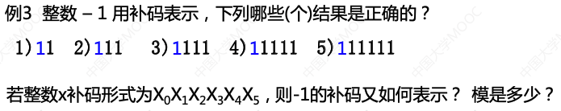
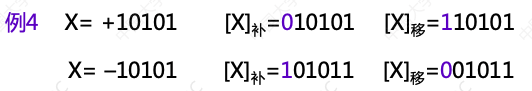
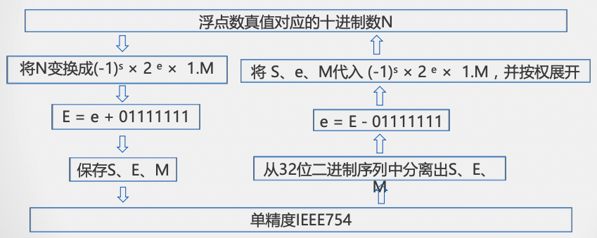

[华中科大(计算机组成原理)](https://www.icourse163.org/course/HUST-1003159001)

- [数据表示](#数据表示)
    - [1.机器数及其特点](#1机器数及其特点)
        - [1.1 为什么研究机器内的数据表示](#11-为什么研究机器内的数据表示)
        - [1.2 机器内的数据表示](#12-机器内的数据表示)
        - [1.3 常见机器数的特点](#13-常见机器数的特点)
        - [1.4 移码(增码)](#14-移码(增码))
    - [2.定点与浮点数数据表示](#2定点与浮点数数据表示)
        - [2.1 定点数据表示](#21-定点数据表示)
        - [2.2 浮点数据表示](#22-浮点数据表示)
    - [3.数据校验的基本原理](#3数据校验的基本原理)
        - [3.1 数据校验的必要性](#31-数据校验的必要性)
        - [3.2 校验的基本原理](#32-校验的基本原理)
        - [3.3 码距的概念](#33-码距的概念)
        - [3.4 码距与检错或纠错能力的关系](#34-码距与检错或纠错能力的关系)
        - [3.5 选择码距要考虑的因素](#35-选择码距要考虑的因素)
    - [4.奇偶校验](#4奇偶校验)
        - [4.1 奇偶校验的基本原理](#41-奇偶校验的基本原理)
        - [4.2 奇偶校验的特点](#42-奇偶校验的特点)
        - [4.3 奇偶校验的码距](#43-奇偶校验的码距)
        - [4.4 关于奇/偶校应用的讨论](#44-关于奇/偶校应用的讨论)
    - [5.CRC校验及其实现](#5CRC校验及其实现)
        - [5.1 CRC校验的基本原理](#51-CRC校验的基本原理)
        - [5.2 模2除运算](#52-模2除运算)
        - [5.3 CRC编码方法](#53-CRC编码方法)
    - [6.海明校验及其实现](#6海明校验及其实现)
        - [6.1 海明校验的基本原理](#61-海明校验的基本原理)

------

# 数据表示

## 1.机器数及其特点

### 1.1 为什么研究机器内的数据表示

**目的**：组织数据，方便计算机硬件直接使用

**要考虑的因素**：支持的数据类型、 能表示的数据范围、能表示的数据精度、存储和处理的代价、是否有利于软件的移植等

### 1.2 机器内的数据表示

**真值**：符号用`+`、`-`表示的数据表示方法

**机器数**：用符号值化的数据表示方法，用`0`、`1`表示符号

设定点整数的形式为X0 X1 X2 X3 ... Xn
$$
[x]_原=\begin{cases}
x\quad\quad\quad\ 0≤x<2^n\\
2^n-x\quad2^{-n}≤x<0
\end{cases}
$$

$$
[x]_反=\begin{cases}
x\quad\quad\quad\quad\quad\quad 0≤x<2^n\\
2^{n+1}+x-1\quad2^{-n}≤x<0
\end{cases}
\quad mod\ 2^{n+1}-1
$$

$$
[x]_补=\begin{cases}
x\quad\quad\quad\ 0≤x<2^n\\
2^{n+1}+x\quad2^{-n}≤x<0
\end{cases}
\quad mod\ 2^{n+1}
$$

### 1.3 常见机器数的特点

1.  原码

    -   表示简单: 
        $$
        [x]_原 = 2^n-x
        $$

    -   运算复杂:符号位不参加预算，要设置加法、减法器。

    -   0的表示不唯一

    $$
    [x]_原 + [y]_原 （不能直接判定是执行加法还是减法运算，分同号和异号）
    $$

    

2.  反码

    -   表示相对原码复杂：
        $$
        [x]_反 = 2^{n+1}+x-1
        $$

    -   运算相对原码简单:符号位参加运算, 只需要设置加法器，但符号位的进位位需要加到最低位。

    -   0的表示不唯一

    

3.  补码

    -   表示相对复杂：
        $$
        [x]_反=2^{n+1}+x
        $$

    -   运算简单:只需设置加法器。

    -   0的表示唯一

    补码中模的概念(符号位进位后所在位的权值)

    

### 1.4 移码(增码)

移码表示浮点数的阶码，IEEE754中阶码用移码表示。

设定点整数X的移码形式为X0X1X2X3...Xn

则移码的定义是:
$$
[x]_移=2^n+x\quad -2^n < x ≤ 2^n
(X为真值，n为X的整数位位数)
$$
具体实现:数值位与X的补码相同，符号位与补码相反。

## 2.定点与浮点数数据表示

### 2.1 定点数据表示

可表示定点小数和整数

表现形式:X0.X1X2X3X4........Xn

定点小数表示数的范围(补码为例): 
$$
-1 ≤x ≤1-2^{-n}
$$
定点整数表示数的范围(补码为例):
$$
-2^n≤x≤2^n-1
$$
定点数据表示数的不足:数据表示范围受限

### 2.2 浮点数据表示

**把数的范围和精度分别表示的一种数据表示方法**

浮点数的使用场合:  当数的表示范围超出了定点数能表示的范围时

#### 一般格式

**一般表示格式的不足**: 不同系统可能根据自己的浮点数格式从中提取不同位数的阶码

#### IEEE 754格式

指数采用偏移值，其中单精度偏移值为127，双精度为1023，将浮点 数的阶码值变成非负整数,便于浮点数的比较和排序。

IEEE754尾数形式为1.XXXXXX,其中M部分保存的是XXXXXX(1被隐 藏)，从而可保留更多的有效位，提高数据表示的精确度。

IEEE754 32位浮点数与对应真值之间的变换流程

## 3.数据校验的基本原理

### 3.1 数据校验的必要性

受元器件的质量、电路故障或噪音干扰等因素的影响，数据在被处理、传输、存储的过程中可能出现错误;

若能设计硬件层面的错误检测机制，可以减少基于软件检错 的代价(系统观)。

### 3.2 校验的基本原理

增加冗余码(校验位)

### 3.3 码距的概念

同一编码中，任意两个合法编码之间不同二进数位数的最小值;

0011与0001 的码距为1，一位错误时无法识别;

0000、0011、0101、0110、1001、1010、1100、1111等编码码 距为2。任何一位发生改变，如0000变成1000就从有效编码变成了 无效编码，容易检测到这种错误。

校验码中增加冗余项的目的就是为了增大码距。

### 3.4 码距与检错或纠错能力的关系

### 3.5 选择码距要考虑的因素

-   有效信息(k位) | 校验信息(r位)

码距越大，抗干扰能力越强，纠错能力越强，数据冗余越大， 编码效率低，编码电路也相对复杂;

选择码距必须考虑信息发生差错的概率和系统能容许的最小差错率。

## 4.奇偶校验

### 4.1 奇偶校验的基本原理

-   增加冗余码(校验位)

-   编码:根据有效信息计算校验信息位，使校验码(数据+ 1位校验信息)中1的个数满足奇/偶校验的要求

    

-   检错方法与电路

### 4.2 奇偶校验的特点

1.  编码与检错简单
2.  编码效率高
3.  不能检测偶数位错误, 无错结论不可靠，**是一种错误检测码**
4.  不能定位错误，因此不具备纠错能力

### 4.3 奇偶校验的码距

### 4.4 关于奇/偶校应用的讨论

1.  在内存上使用校验
2.  一般在同步传输方式中常采用奇校验，异步传输方式中常采用偶校验

## 5.CRC校验及其实现

### 5.1 CRC校验的基本原理

-   增加冗余码(校验位)

-   生成多项式G(x)

    收发双方约定的一个(r + 1)位二进制数，发送方利用G(X)对信息多项式做模2除运算,生成校验 码。接收方利用G(X)对收到的编码多项式做模2除运算检测差错及错误定位。

-   G(x)应满足的条件

    1.  最高位和最低位必须为1;
    2.  当被传送信息(CRC码)任何一位发生错误时，被生成多项式做除后应该使余数不为0;
    3.  不同位发生错误时，模2除运算后余数不同;
    4.  对不为0余数继续进行模2除运算应使余数循环。

-   常见生成多项式G(x)

    

### 5.2 模2除运算

#### 模2运算规则

1.  加/减运算 (异或运算，加不进位，减不借位)

2.  模2除法, 按模2减，求部分余数，不借位。

3.  上商原则

    部分余数首位为1时，商为1，减除数;

    部分余数首位为0时，商为0，减0;

    当部分余数的位数小于除数的位数时，该余数即为最后余数。

### 5.3 CRC编码方法

1.  根据待校验信息的长度k，按照 k+r ≤ 2^r-1 确定校验位r的位数 如对4位信息 **1100** 进行CRC编码，根据 4+r ≤ 2r-1

    得rmin=3

2.  根据r 和生成多项式的选择原则，选择位数为 **r +1** 的生成多项式G(X)=1011

3.  进行下列变化

    即:将待校验的二进制信息Q(X)逻辑左移 r 位,得到Q(X)

## 6.海明校验及其实现

### 6.1 海明校验的基本原理

-   增加冗余码(校验位)

