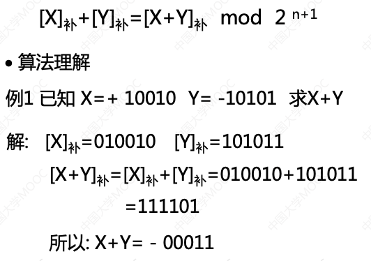
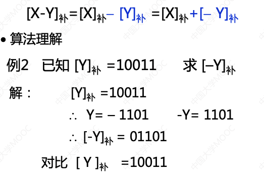
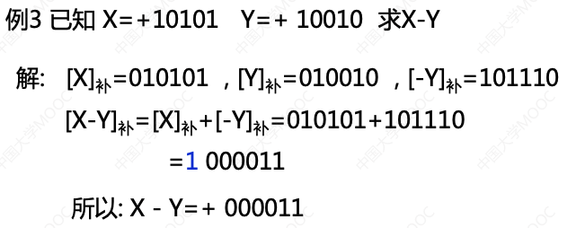
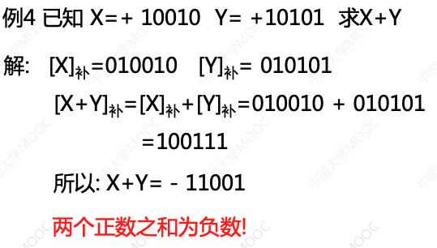
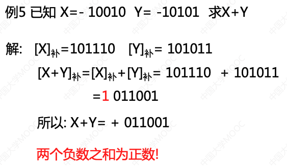
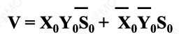
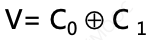
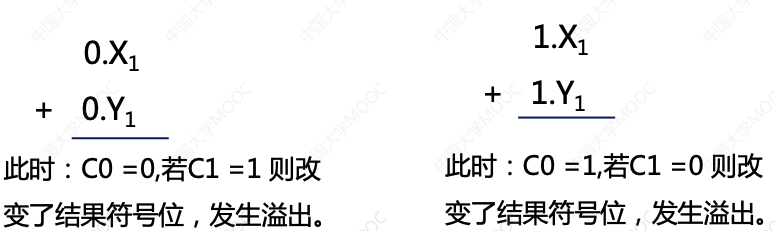
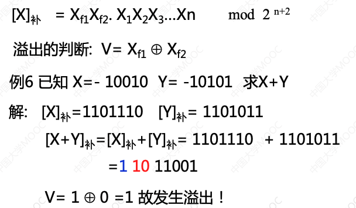
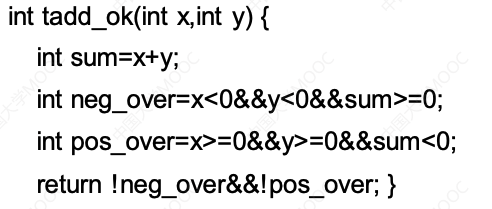

[华中科大(计算机组成原理)](https://www.icourse163.org/course/HUST-1003159001)

- [运算方法与运算器](#运算方法与运算器)
    - [1.定点数运算的溢出检测](#1定点数运算的溢出检测)
        - [1.1 定点数加法运算](#11-定点数加法运算)
        - [1.2 定点数减法运算](#12-定点数减法运算)
        - [1.3 有符号数溢出的概念及其判断方法](#13-有符号数溢出的概念及其判断方法)
        - [1.4 无符号数运算的溢出判断](#14-无符号数运算的溢出判断)

    - [2.定点数补码加、减运算器设计](#2定点数补码加、减运算器设计)
    - [3.原码一位乘法](#3原码一位乘法)
    - [4.补码一位乘法](#4补码一位乘法)
    - [5.乘法运算器设计](#5乘法运算器设计)
    - [6.定点数除法](#6定点数除法)
    - [7.浮点数加减运算](#7浮点数加减运算)

------

# 运算方法与运算器

## 1.定点数运算的溢出检测

### 1.1 定点数加法运算

### 1.2 定点数减法运算

可知 : 通过右向左扫描[Y], 在遇到数字1之前，直接输出遇到的数字，遇 补， 到1之后，取反输出，即可得到[-Y]补，反之亦然!

### 1.3 有符号数溢出的概念及其判断方法

#### 溢出的概念

运算结果超出了某种数据类型的表示范围。

#### 溢出的检测方法

溢出只可能发生在同符号数相加时，包括[X]补与[Y]补; [X]补 与[-Y]同号;

1.  对操作数和运算结果的符号位进行检测, 当结果的符号位与操作数的符号不相同时就表明发生了溢出. (设X0 ，Y0 为参加运算数的符号位， S0 为结果的符号位), 当V=1时，运算结果溢出，根据该逻辑表达式，容易画出相应电路。

2.  对最高有效进位和符号进位进行检测, 设运算时最高有效数据位产生的进位为C1，符号位产生的进位为C0，溢出检测电路为:

    

3.  用变型补码

    

4.  溢出判断的软件方法

    

    体会软/硬件功能的等效性和差异性!

    体会软/硬协同的系统观!

#### 1.4 无符号数运算的溢出判断

无符号数加法的溢出可用ALU的进位表示

无符号数减法溢出(借位)不能用进位直接表示，而是进位信号取反后的结果。

## 2.定点数补码加、减运算器设计

## 3.原码一位乘法

## 4.补码一位乘法

## 5.乘法运算器设计

## 6.定点数除法

## 7.浮点数加减运算

