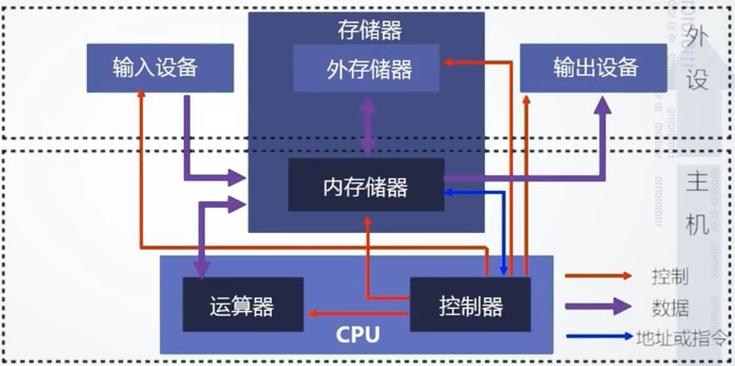

# 计算机组成原理

[华中科大(计算机组成原理)](https://www.icourse163.org/course/HUST-1003159001)

- [导学](#导学)
- [第一篇 概论](#第一篇-概论)
- [第一章 冯诺依曼结构原理及层次结构分析](#第一章-冯诺依曼结构原理及层次结构分析)
    - [1.1 冯诺依曼](#11-冯诺依曼)
    - [1.2 冯诺依曼计算机的工作原理](#12-冯诺依曼计算机的工作原理)
    - [1.3 冯诺依曼计算机的组成（硬件+软件）](#13-冯诺依曼计算机的组成（硬件+软件）)

------

# 导学

介绍运算器、控制器、存储器的结构、工作原理

构造观+系统观+工程关的学习视角和学习方法

构造观——掌握设计方法

1. 如何设计功能部件：基本编码/解码器、运算器、控制器、存储器
2. 如何设计系统：简单计算机系统
3. 利用仿真软件Logisim（开源）

系统观——软/硬协同的视角

1. 理解计算机系统的构成及各部分之间的相互影响
2. 理解不同系统/结构对程序的影响（包括功能、性能、可移植性等方面）
3. 理解数据表示、校验技术、运算器结构、存储器组织、寻址方式等程序运行结果正确性、效率等方面的影响
4. 牢固树立软/硬协同的观念：程序员要充分了解并利用硬件的特性

工程观——系统实现视角

1. 如果高效实现所设计硬件功能部件或系统
2. 如何克服工程制约条件
3. 如何降低成本
4. 如何提高可靠性
5. 如何提高性能
6. 如何节能

# 第一篇 概论

## 第一章 冯诺依曼结构原理及层次结构分析

### 1.1 冯诺依曼

[冯诺依曼](https://baike.baidu.com/link?url=8BAinjRdmAa1HgUNtx2yUkYNb20swvaD0F8AakMzbVSa-ynsdTLgdaUsfUMYrz7m8BgJ6UIB0yXruCOUA5mcDwH2yXnVZEX36GesP_BllopCSrfk8FS6Nl1Qyhb4yXpSvOfh_KI4xEAl9fz1uky3DFW7NpYrRMIYkKSC0lZGtEi)是20世纪最重要的数学教之一，被誉为计算机之父，因其在现代计算机、博弈论等领域的重大贡献成为美国科学院院士

### 1.2 冯诺依曼计算机的工作原理

存储程序：将程序存放在计算机的存储器中——存储程序构建与快速访问

程序控制：按指令地址访问存储器并取出指令，经译码依次产生指令执行所需的控制信号，实现对计算的控制，完成指令的功能——指令系统、控制器设计等

### 1.3 冯诺依曼计算机的组成（硬件+软件）

#### 硬件系统（总体图）

> 主机：CPU（运算器+控制器）、内存
>
> 外设：输入/输出设备、外存储器
>
> 总线：地址线、数据线、控制线

#### 软件系统

可运行的思想和内容的数字化

> 思想：算法、规律、方法——程序表达
>
> 内容：图形、图像、数据、声音、文字等被处理的对象

软件的表现形式：程序和数据（以二进制表示的信息）

软件的核心：算法

> 软件的分类
>
> 系统软件：如操作系统、网络系统和编译系统
>
> 支持软件：如开发工具、界面工具等
>
> 应用软件：如字处理软件、游戏软件等

#### 硬件与软件系统间的关系