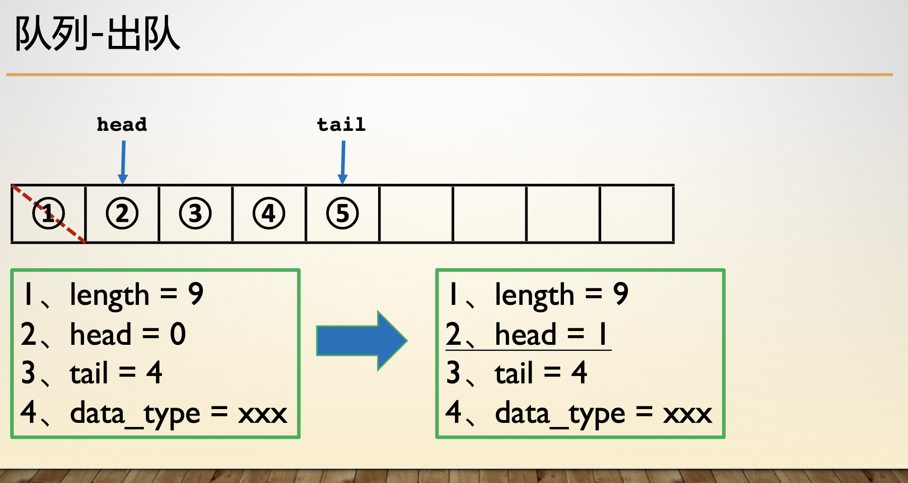
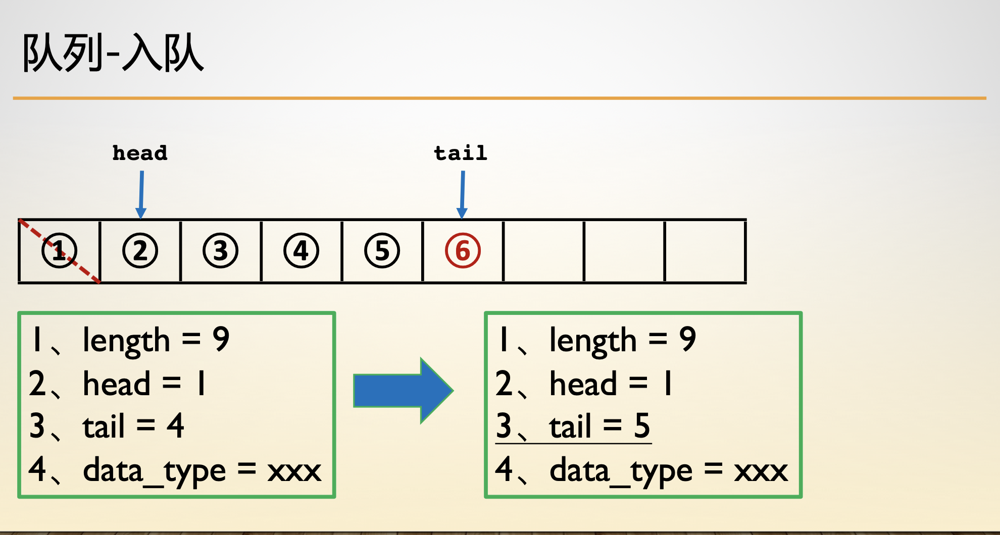
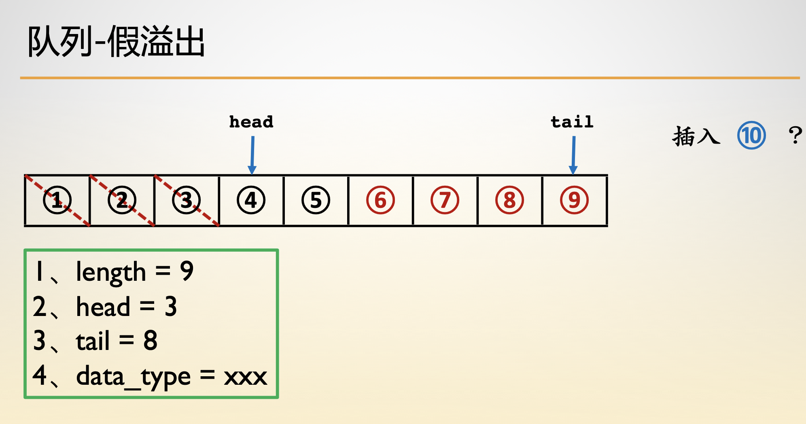
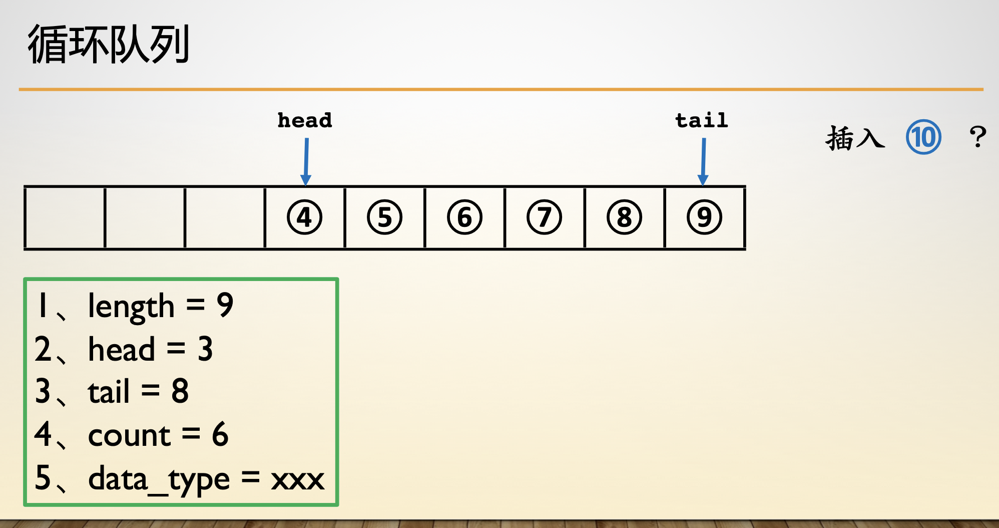

- 队列
- [1.结构定义](#1结构定义)
- [2.队列构建](#2队列构建)
- [3.队列出队](#3队列出队)
- [4.队列入队](#4队列入队)
- [5.队列假溢出](#5队列假溢出)
- [6.循环队列](#6循环队列)

------

# 队列

## 1.结构定义

- 排队类型， FIFO(first in first out)。时间复杂度 O(n)

    - 初始化、判空、入队、遍历、出队、读头

- 单调队列：从队尾比较、维护区间最值

    - 区间最大值 ：降序排列
    - 区间最小值 ： 升序排列

```c
typedef struct Queue {
    int *data;
    int head, tail, length, count;
} Queue;
特点 //FIFO 先进先出
```

## 2.队列构建


```c
Queue *init(int n) {
    Queue *q = (Queue *)malloc(sizeof(Queue));
    q->data = (int *)malloc(sizeof(int) * n);
    q->length = n;
    q->count = 0;
    q->head = q->tail = 0;
    return q;
}
```

## 3.队列出队



```c
void pop(Queue *q) {
    q->head += 1;
    if (q->head >= q->length) q->head -= q->length;
    q->count -= 1;
    return ;
}
```

## 4.队列入队



```c
void push(Queue *q, int val) {
    if (q->count == q->length) return ;
    q->data[(q->tail)++] = val;
    if (q->tail >= q->length) q->tail -= q->length;
    q->count += 1;
    return ;
}
```

## 5.队列假溢出



假溢出引出循环队列

## 6.循环队列

