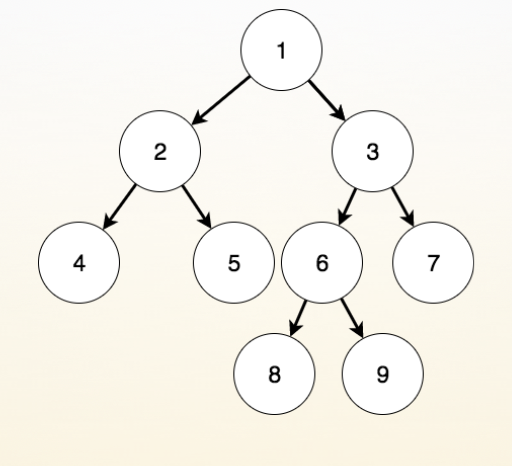
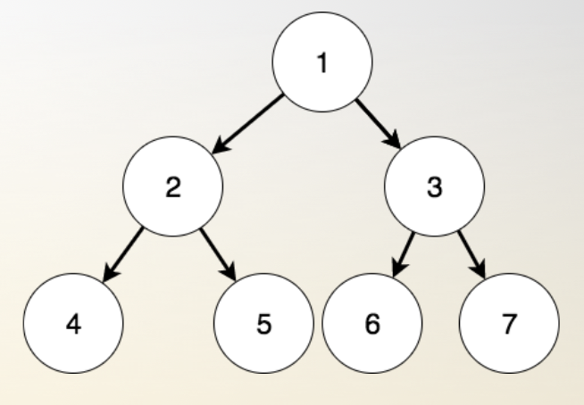
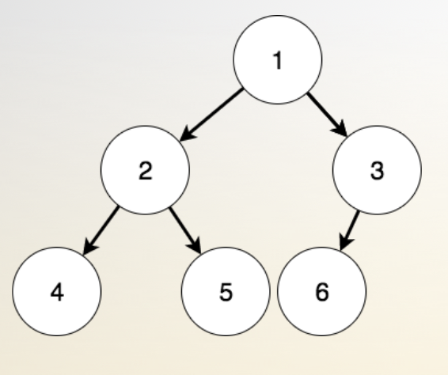

* [二叉树](#二叉树)
    * [1.定理](#1定理)
        * [1.1 二叉树](#11-二叉树)
        * [1.2 满二叉树](#12-满二叉树)
        * [1.3 完美二叉树](#13-完美二叉树)
        * [1.4 完全二叉树](#14-完全二叉树)
        * [1.5 哈夫曼树](#15-哈夫曼树)

    * [2.遍历](#前中后序遍历)
        * [2.1 递归版](#21-递归版)
        * [2.2 迭代版](#22-迭代版)
    * [3.代码展示](#3代码展示)


------

# 二叉树

## 1.定理

### 1.1 二叉树

- 倒着长的树， 时间复杂度 O(logn)

    - 度：节点拥有的子树个数
    - 叶子节点：度为0的节点
    - 创建结构体：data, *lchild, *rchild

    - 存储
- 遍历 ： 知二得其一

    - 先序:根左右

        - 中序:左根右

        - 后序:左右根

    - 广义表

    - leetcode100、101、102、104、107、110、111、112、226、235、257、297

### 1.2 满二叉树

- 没有度为1的节点
- 

### 1.3 完美二叉树

- 树是满的，而且二叉
- 

### 1.4 完全二叉树

- 树的倒数第二层之前是完美的， 最后一层左节点对齐
- 

### 1.5 哈夫曼树

- 统计每种字母在字符串中出现的频率，根据频率建立一颗路径带权的二叉树，树上的每个节点存储字母出现的频率，根节点到节点的路径即是字母的编码。

    - 步骤1:从集合里取出两个根结点权值最小的树 a 和 b, 构造出一棵新的二叉树 c, 二叉树 c 的左右子树分别是 a 和 b。

    - 步骤2:将二叉树 a 和 b 从集合里删除, 把二叉树 c 加入集合里。

    - 步骤3:重复以上两个步骤,直到集合里只剩下一棵二叉树,最后剩下的就是哈夫曼树了。

```c
/*************************************************************************
	> File Name: huffman.c
	> Author: 
	> Mail: 
	> Created Time: 六  4/27 16:45:54 2019
 ************************************************************************/

#include <stdio.h>
#include <stdlib.h>
#include <string.h>

#define swap(a, b) { \
    __typeof(a) __temp = a; \
    a = b; b = __temp; \
}

typedef struct Data {
    char ch;
    int freq;
} Data;

typedef struct Node {
    Data d;
    struct Node *lchild, *rchild;
} Node;

Node *getNewNode(Data val) {
    Node *p = (Node *)malloc(sizeof(Node));
    p->lchild = p->rchild = NULL;
    p->d = val;
    return p;
}

Node *build_huffman(Data *data, int n) {
    Node **arr = (Node **)malloc(sizeof(Node *) * n);
    for (int i = 0; i < n; i++) arr[i] = getNewNode(data[i]);
    int ind1 = 1, ind2 = 1, r1, r2;
    for (int i = 0; i < n - 1; i++) {
        r1 = n - i - 1, r2 = n - i - 2;
        if (arr[r1]->d.freq > arr[r2]->d.freq) swap(arr[r1], arr[r2]);
        ind1 = 1, ind2 = 0;
        if (arr[ind1]->d.freq > arr[ind2]->d.freq) swap(ind1, ind2);
        for (int j = 2; j < n - i; j++) {
            if (arr[j]->d.freq < arr[ind1]->d.freq) {
                ind2 = ind1, ind1 = j;
            } else if (arr[j]->d.freq < arr[ind2]->d.freq) {
                ind2 = j;
            }
        }
        if (ind2 - r2) swap(arr[ind2], arr[r2]);
        if (ind1 - r1) swap(arr[ind1], arr[r1]);
        Data temp = {0, arr[r1]->d.freq + arr[r2]->d.freq};
        Node *new_node = getNewNode(temp);
        new_node->lchild = arr[r1];
        new_node->rchild = arr[r2];
        arr[r2] = new_node;
    } 
    Node *root = arr[0];
    free(arr);
    return root;
}

void clear(Node *node) {
    if (node == NULL) return ;
    clear(node->lchild);
    clear(node->rchild);
    free(node);
    return ;
}

void preorder(Node *root) {
    if (root == NULL) {
        printf("null ");
        return ;
    }
    printf("%c ", (root->d.ch == 0 ? '0' : root->d.ch));
    preorder(root->lchild);
    preorder(root->rchild);
    return ;
}

void extract_huffman_code(Node *root, char **code, char *buff, int k) {
    if (root->lchild == NULL && root->rchild == NULL) {
        buff[k] = 0;
        code[root->d.ch] = strdup(buff);
        return ;
    }
    buff[k] = '0'; extract_huffman_code(root->lchild, code, buff, k + 1);
    buff[k] = '1'; extract_huffman_code(root->rchild, code, buff, k + 1);
    return ;
}

int main() {
    int n, freq;
    char str[100];
    char *code[256] = {0};
    Data data[256];
    scanf("%d", &n);
    for (int i = 0; i < n; i++) {
        scanf("%s%d", str, &freq);
        data[i].ch = str[0];
        data[i].freq = freq;
    }
    Node *root = build_huffman(data, n);
    extract_huffman_code(root, code, str, 0);
    preorder(root), printf("\n");
    for (int i = 0; i < 256; i++) {
        if (code[i]) printf("%c = %s\n", i, code[i]);
    }
    clear(root);
    return 0;
}
```

## 2.遍历

* **前序**遍历：根->左->右
* **中序**遍历：左->根->右
* **后序**遍历：左->右->根

假设树节点的定义如下：

```c++
typedef struct Node {
    int key;
    struct Node *lchild, *rchild;
} Node;
```

### 2.1 递归版

```c
void pre_order(Node *tree) {
    if (tree == NULL) return ;
    printf("%d ", tree->key);
    pre_order(tree->lchild);
    pre_order(tree->rchild);
    return ;
}

void in_order(Node *tree) {
    if (tree == NULL) return ;
    in_order(tree->lchild);
    printf("%d ", tree->key);
    in_order(tree->rchild);
    return ;
}

void post_order(Node *tree) {
    if (tree == NULL) return ;
    post_order(tree->lchild);
    post_order(tree->rchild);
    printf("%d ", tree->key);
    return ;
}
```

### 2.2 迭代版

需要使用一个栈作为辅助空间

```c++
// 前序遍历
void preorderTraversalIteration(TreeNode *root) {
    stack<TreeNode*> st;
    if (root)
        st.push(root);

    while(!st.empty()) {
        TreeNode *nd = st.top();
        st.pop();

        cout << nd->val << " "; // 操作当前节点

        if (nd->right)
            st.push(nd->right);
        if (nd->left)
            st.push(nd->left);
    }
}

// 中序遍历：
void inorderTraversalIteration(TreeNode *root) {
    stack<TreeNode*> st;

    TreeNode *curr = root;

    while (curr || !st.empty()) {
        if (curr) {
            st.push(curr);
            curr = curr->left;
        } else {
            curr = st.top();
            st.pop();

            cout << curr->val << " "; // 操作当前节点

            curr = curr->right;
        }
    }
}

// 后序遍历
void postorderTraversalIteration(TreeNode *root) {
    stack<TreeNode*> st;
    TreeNode *pre;

    if (root)
        st.push(root);

    while (!st.empty()) {
        TreeNode *nd = st.top();
        /*
         * 出栈条件：
         * 对于叶子节点：直接弹出
         * 对于非叶子节点：如果已经遍历过其左子节点或右子节点，则弹出
         */
        if ((!nd->left && !nd->right) || (pre && (nd->left == pre || nd->right == pre))) {
            st.pop();
            cout << nd->val <<" "; // 操作当前节点
            pre = nd;
        } else { // 说明是一个非叶子节点，并且还未访问其左右孩子
            if (nd->right)
                st.push(nd->right);
            if (nd->left)
                st.push(nd->left);
        }
    }
}
```

对于后序遍历，由于其访问序列为：左->右->根。因此还有一种方法，可以按类似前序遍历的方式：根->右->左，然后对得到的结果反序

## 3.代码展示

```c#
/*************************************************************************
	> File Name: binarytree.c
	> Author: 
	> Mail: 
	> Created Time: 日  4/14 20:24:27 2019
 ************************************************************************/

#include <stdio.h>
#include <stdlib.h>
#include <time.h>

typedef struct Node {
    int key;
    struct Node *lchild, *rchild;
} Node;

Node *getNewNode(int key) {
    Node *p = (Node *)malloc(sizeof(Node));
    p->key = key;
    p->lchild = p->rchild = NULL;
    return p;
}

Node *insert(Node *tree, int val) {
    if (tree == NULL) return getNewNode(val);
    if (tree->key == val) return tree; 
    if (tree->key > val) tree->lchild = insert(tree->lchild, val);
    else tree->rchild = insert(tree->rchild, val);
    return tree;
}

void pre_order(Node *tree) {
    if (tree == NULL) return ;
    printf("%d ", tree->key);
    pre_order(tree->lchild);
    pre_order(tree->rchild);
    return ;
}

void in_order(Node *tree) {
    if (tree == NULL) return ;
    in_order(tree->lchild);
    printf("%d ", tree->key);
    in_order(tree->rchild);
    return ;
}

void post_order(Node *tree) {
    if (tree == NULL) return ;
    post_order(tree->lchild);
    post_order(tree->rchild);
    printf("%d ", tree->key);
    return ;
}

void clear(Node *tree) {
    if (tree == NULL) return ;
    clear(tree->lchild);
    clear(tree->rchild);
    free(tree);
    return ;
}

int main() {
    #define MAX_OP 20
    srand(time(0));
    Node *root = NULL;
    for (int i = 0; i < MAX_OP; i++) {
        int val = rand() % 100;
        printf("insert %d to binary search tree\n", val);
        root = insert(root, val);
        printf("pre order = "), pre_order(root), printf("\n");
        printf("in order = "), in_order(root), printf("\n");
        printf("post order = "), post_order(root), printf("\n");
    }
    return 0;
}
```

