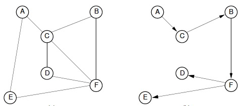
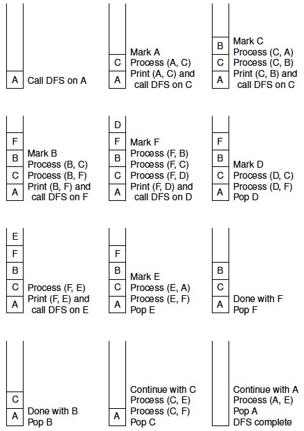
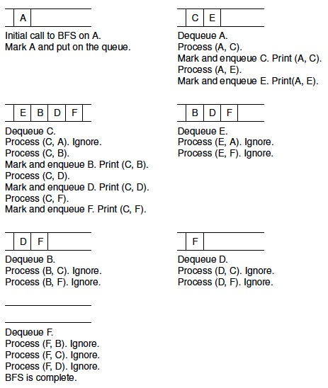
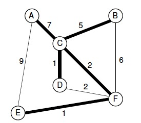
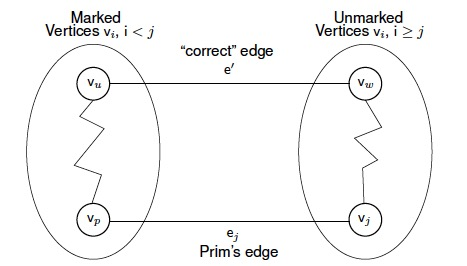

* [图的表示](#图的表示)
    - [1.邻接矩阵](#1邻接矩阵)
    - [2.邻接表](#2邻接表)
* [图的遍历](#图的遍历)
    * [DFS(深度优先遍历)](#dfs深度优先遍历)
    * [BFS(广度优先遍历)](#bfs广度优先遍历)
    * [拓扑排序](#拓扑排序)
* [最小生成树](#最小生成树) 
    * [Prim算法](#Prim算法) 
* [图论](#图论)

**图可以用G=(V,E)来表示，每个图都包括一个顶点集合V和一个边集合E，顶点总数记为|V|，边总数记为|E|**

* **稀疏图**：边数较少的图
* **密集图**：边数较多的图
* **完全图**：包含所有可能边的图
* **带权图**：边上标有权的图
* **邻接点**：一条边所连的两个顶点
* **简单路径**：路径上不包含重复顶点的图
* **回路**：将某个顶点连接到本身，且长度大于等于3的路径
* **无环图**：不带回路的图

## 图的表示

图有两种常用的表示方法：

* **邻接矩阵**
* **邻接表**

### 1.邻接矩阵

使用一个二维矩阵来表示图:

* (i,j)=1，表示顶点i到顶点j之间有一条边（**非带权图**）
* (i,j)=n，表示顶点i到顶点j之间有一条权重为n的边（**带权图**）

**使用邻接矩阵的空间代价总是O(|V|^2)**

### 2.邻接表

邻接表使用一个顶点指针数组来表示：

* 数组的元素i表示顶点i的指针，它是一个链表的头结点
* 链表其余的顶点表示与顶点i之间存在边的顶点

**邻接表的空间代价与图中边的数目和顶点的数目均有关系。每个顶点要占据一个数组元素的位置，且每条边必须出现在其中某个顶点的边链表中**

## 图的遍历

### DFS(深度优先遍历)

DFS会递归地访问它的所有未被访问的相邻顶点：

1. 先访问顶点v，把所有与v相关联的边存入栈中；
2. 弹出栈顶元素，栈顶元素代表的边所关联的另一个顶点就是要访问的下一个元素k；
3. 对k重复对v的操作；
4. 重复，直至栈中所有元素都被处理完毕

DFS的执行过程将产生一棵**DFS(深度优先搜索)树**：

整个DFS的过程如下：

> 相关题目：
>
> * [Leetcode：695.Max Area of Island](https://leetcode.com/problems/max-area-of-island/description/)

### BFS(广度优先遍历)

使用一个队列。对于每个顶点，在访问其它顶点前，检查当前节点所有邻接点。和树的广度优先遍历类似

BFS执行过程将产生一棵**BFS(广度优先搜索)树**：

整个BFS的过程如下：

### 拓扑排序

**(DAG)有向无环图**可以描述这样一种场景：有一组任务，任务的执行顺序之间具有依赖性，一些任务必须在另一些任务完成之后才开始执行，如下图：

在这种场景下，任务之间的依赖关系不能出现环，否则任何一个都无法开始执行。**将一个(DAG)有向无环图中所有顶点在不违反先决条件规定的基础上排成线性序列的过程就是拓扑排序**

有2种方法实现拓扑排序：

* **基于DFS的方法(递归)**：当访问某个顶点时，不对这个顶点进行任何处理。当递归返回到这个顶点时，打印这个顶点。这将产生一个逆序的拓扑排序。对其进行一次反序操作就可以得到一个拓扑排序的序列。序列从哪个顶点开始并不重要，只要所有顶点最终都能被访问到
* **基于BFS的方法(迭代)**：首先访问所有的边，计算指向每个顶点的边数(即计算每个顶点的先决条件数目)。将所有没有先决条件的顶点放入队列，然后开始处理队列。当从顶点中删除一个顶点时，把它打印出来，同时将其所有相邻顶点的先决条件计数减1。当某个相邻顶点的计数为
0时，就将其放入队列。如果还有顶点未被打印，而队列已经为空，则图中必然包含回路

## 最小生成树

最小生成树(MST)是一个包括图G所有顶点及其部分边的图，包括的边是G的子集，满足下列条件：

* 这个子集中所有边的权之和为所有子集中最小的
* 子集中的边能保证图是连通的

下面是一个最小生成树的例子：

如果上图中使用边(D,F)代替(C,F)，可得到另一个最小生成树，即最小生成树可能有多个

> 最小生成树适合解决如下问题：怎样使连接电路板上一系列接头所需焊接的线路最短，或者怎样使得在几个城市之间建立电话网所需的线路最短

### Prim算法

**原理**：从图中任意一个节点N开始，初始化，MST为N。选出与N相关联的边中权最小的一条边，设其连接顶点N与另一个顶点M。把顶点M和边(N,M)加入MST中。接下来，选出与顶点N或顶点M相关联的边中权最小的一条边，设其连接另一个新顶点，将这条边和新顶点添加到MST中。反复进行这样的处理，每一步都选出一条边来扩展MST，这条边是连接当前已在MST中的某个顶点与一个不在MST中的顶点的所有边中代价最小的

**证明Prim算法能生成MST**：反证法。设图G=(V,E)不能通过Prim算法生成最小生成树。根据Prim算法中各顶点加入MST的顺序，依次定义图G中各顶点为v0,v1,...,v(n-1)。令ei代表边(vx,vi)，其中x<i且i>=1，令ej为Prim算法添加的序号最小的那条(第一条)出现以下情况的边：加入ej后的边集不能被扩展而构成图G的一个MST。换句话说，ej是Prim算法发生错误的第一条边。设T为“真正的”MST。令vp为边ej所关联的顶点，即ej=（vp,vj）  
因为T是一个树结构，所以T中将存在一条连接vp和vj的路径，且此路径中一定存在某条边e'连接vu和vw，其中u<j，w>=j。因为ej不是T的一部分，所以把ej加入到T会构成一个回路。又因为Prim算法不能生成一个MST，所以e'的权比ej的权更小。这种情况如下图。但是，Prim算法应选择可能的最小权边，它一定会选择e'，而不是ej。这与Prim算法选错了边ej的假设相矛盾。因此，Prim算法一定是正确的

## 图论

- 洪水灌溉法(FloodFill)、时间复杂度O(V + E)

    - 1、找到一个没有染色的顶点,将其染为新的颜色 ColornewColor new ,如果没有则算法结
    - 2、初始化一个空的队列,并将第一步的顶点插入队列。
    - 3、不断获得队首元素的值并弹出,将和队首元素相邻的未染色顶点染为 ColornewColor new
    - 4、重复执行第一步,直到所有顶点都被染色,算法结束。

- 最小生成树问题

    - Prim

        - Prim 算法。首先我们定义带权图 GG 的顶点集合为 VV,接着我们再定义最小生成树的顶点集合为 UU,初始集合 UU 为空。
        - 1、我们任选一个顶点 x,加入集合 U ,并记录每个顶点到当前最小生成树的最短距离。
        - 2、选择一个距离当前最小生成树最近的,且不属于集合 U的顶点 v(如果有多个顶点 v，任选其一即可),将顶点 v 加入集合 U ,并更新å所有与顶点 v 相连的顶点到当前最小生成树的距离
        - 3、重复第二步操作,直至集合 U 等于集合 V
        - 分析算法过程，我们可以发现，Prim 算法的思想类似贪心策略，每次都会选择一条与当前最小生成树相连且边权值最小的点。Prim 算法的时间复杂度为 O(V2)，V 为图 G 顶点总个数，如果加上堆优化的话，可以把时间复杂度降到 O(VlogV+E)，其中 E 为图 G 的总边数。Prim 算法一般应用于边较为稠密的图，也就是顶点较少而边较多的图

    - Kruskal

        - Kruskal 算法。首先我们定义带权图 G 的边集合为 E，接着我们再定义最小生成树的边集合为 T，初始集合 T 都为空。
        - 1、首先，我们把图 G 看成一个有 n 棵树的森林，图上每个顶点对应一棵树。
        - 2、接着，我们将边集合 E 的每条边，按权值从小到大进行排序，
        - 3、依次遍历每条边 e=(u,v)，我们记顶点 u 所在的树为 T u ，顶点 v 所在的树为 Tv ，如果 T u  和 T v​ 不是同一棵树，则我们将边 e 加入集合 T，并将两棵树 T u 和 T v 进行合并。
        - Kruskal 算法也是采用了贪心的策略，每次都会选择一条两个顶点不在同一棵树且权值最小的边加入集合。Kruskal 算法的时间复杂度为 O(ElogE)，E 为图 G 的总边数，所以 Kruskal 算法一般应用于较为稀疏的图，也就是顶点较多、边较少的图。

- 最短路问题

    - Dijkstra

        - 定义带权图 G 所有顶点的集合为 V，接着我们再定义已确定最短路径的顶点集合为 U，初始集合 U 为空。接着执行以下操作：
        - 1、首先我们将起点 x 加入集合 U，并在数组 A 中记录起点 x 到各个点的最短路径（如果顶点到起点 x 有直接相连的边，则最短路径为边权值，否则为一个极大值）。 
        - 2、从数组 A 中选择一个距离起点 x 最近的，且不属于集合 U 的顶点 v（如果有多个顶点 v，任选其一即可），将顶点 v 加入集合 U，并更新所有与顶点 v 相连的顶点到起点 x 的最短路径。
        - 3、重复第二步操作，直至集合 U 等于集合 V。
        - Dijkstra 算法和前面讲解的 Prim 算法很相像，它们都是从一个点开始，每次确定一个点并完成更新，重复操作直至 n 个点都确定为止。Dijkstra 算法的时间复杂度为 O(V 2+E)，V 为顶点总个数，E 为总边数。如果利用堆进行优化，可以将时间复杂度优化为 O(VlogV+E)，这是最坏情况下最优的单源最短路算法。

需要注意的是，Dijkstra 不适用于有边权为负数的情况，否则会影响算法的正确性。