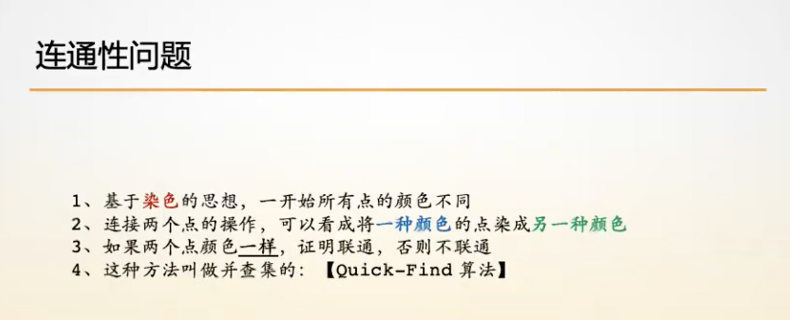
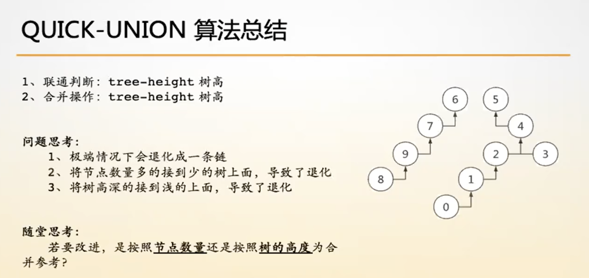
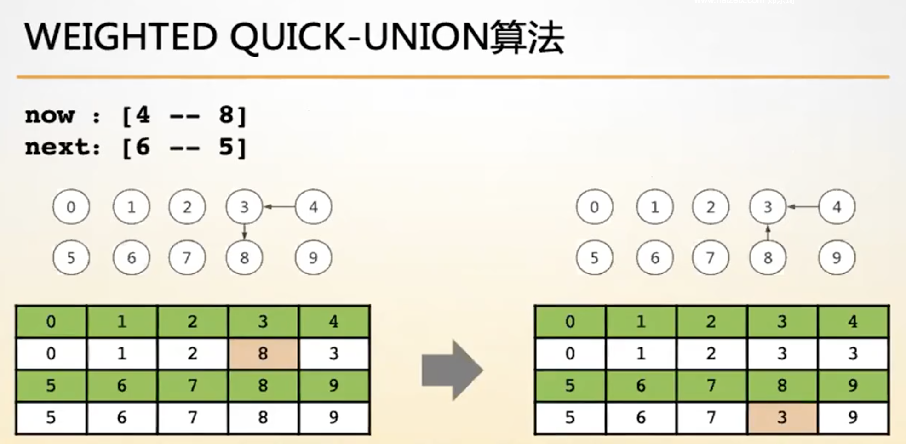

- [Quick_Find](#Quick_Find)
- [Quick_Union](Quick_Union)
- [Weighted_Quick_Union](#Weighted_Quick_Union)
- [Weighted_Quick_Union With Path Compression](#Weighted_Quick_Union With Path Compression)

## Quick_Find

- 联通(union)：O(n)、查找(find)：O(1)
- 解决联通性问题

    - 染色思想

## Quick_Union

- 联通(union)：tree-height、 查找(find)：tree-height

## Weighted_Quick_Union

- 联通(union)：O(logn)、查找(find)：O(logn)
- 按秩优化

## Weighted_Quick_Union With Path Compression

- 联通(union)：O(1)、查找(find)：O(1)
- 路径压缩