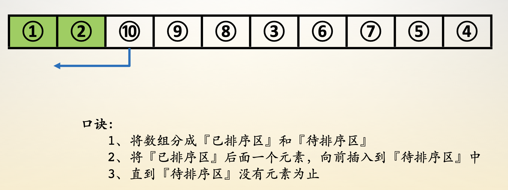
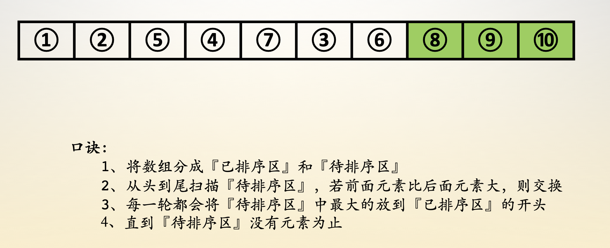
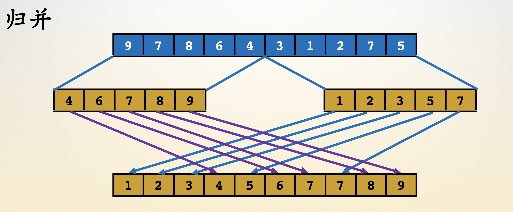
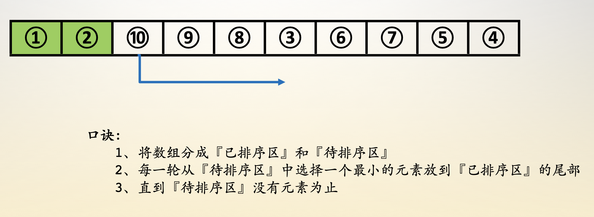

* [1.内排序](#1内排序)
    * [1.1 稳定排序](#11-稳定排序)
        * [1.1.1 插入排序](#111-插入排序)
        * [1.1.2 冒泡排序](#112-冒泡排序)
        * [1.1.3 归并排序](#113-归并排序)
        * [1.1.4 代码展示](#114-代码展示)
    
    * [1.2 非稳定排序](#12-非稳定排序)
        * [1.2.1 选择排序](#121-选择排序)
        * [1.2.2 希尔排序](#122-希尔排序)
        * [1.2.3 快速排序](#123-快速排序)
        * [1.2.4 堆排序](#124-堆排序)
        * [1.2.5 代码展示](#125-代码展示)
    
* [2.外排序](#2外排序)
    * [2.1 多路归并](#21-多路归并)

> 稳定性：相同的元素在排序前和排序后的前后位置是否发生改变，没有改变则排序是稳定的，改变则排序是不稳定的 [——八大排序算法的稳定性](https://www.cnblogs.com/codingmylife/archive/2012/10/21/2732980.html)

------

# 1.内排序

## 1.1 稳定排序

### 1.1.1 插入排序

逐个处理待排序的记录，每个记录与前面已排序已排序的子序列进行比较，将它插入子序列中正确位置

- 时间复杂度（n^2）
- 1、将数组分成【已排序区】和【待排序区】
- 2、将【已排序区】后面的一个元素，向前插入到【已排序区】中
- 3、直到【待排序区】没有元素为止
- 

**代码**

```c
void insert_sort(int *num, int n) {
    for (int i = 1; i < n; i++) {
        for (int j = i; j > 0 && num[j] < num[j - 1]; --j) {
            swap(num[j], num[j - 1]);
        }
    }
    return ;
}
```

**性能**

* 最佳：升序。时间复杂度为O(n)
* 最差：降序。时间复杂度为O(n^2)
* 平均：对于每个元素，前面有一半元素比它大。时间复杂度为O(n^2)

>如果待排序数据已经“基本有序”，使用插入排序可以获得接近O(n)的性能

### 1.1.2 冒泡排序

从数组的底部比较到顶部，比较相邻元素。如果下面的元素更小则交换，否则，上面的元素继续往上比较。这个过程每次使最小元素像个“气泡”似地被推到数组的顶部

- 时间复杂度（n^2）
- 1、将数组分成【已排序区】和【待排序区】
- 2、从头到尾扫描【待排序区】，若前面元素比后面元素大，则交换
- 3、每一轮都会将【待排序区】的最大值放在【已排序区】的开头
- 4、直到【待排序区】没有元素为止
- 

**代码**

```c
void bubble_sort(int *num, int n) {
    int times = 1;
    for (int i = 1; i < n && times; i++) {
        times = 0;
        for (int j = 0; j < n - i; j++) {
            if (num[j] <= num[j + 1]) continue;
            swap(num[j], num[j + 1]);
            times++;
        }
    }
    return ;
}
```

**性能**

冒泡排序是一种相对较慢的排序，没有较好的最佳情况执行时间。通常情况下时间复杂度都是O(n^2)

**优化**

增加一个变量flag，用于记录一次循环是否发生了交换，如果没发生交换说明已经有序，可以提前结束

### 1.1.3 归并排序

将一个序列分成两个长度相等的子序列，为每一个子序列排序，然后再将它们合并成一个序列。合并两个子序列的过程称为归并

- 时间复杂度（nlogn）
- 1、尽量将排序部分分成等大的两部分
- 2、对每个部分进行排序
- 3、将每个部分按照顺序还原成源数据区
- 4、可以利用递归进行
- 

**代码**

```c
void merge_sort(int *num, int l, int r) {
    if (r - l <= 1) {
        if (r - l == 1 && num[l] > num[r]) {
            swap(num[l], num[r]);
        }
        return ;
    }
    int mid = (l + r) >> 1;
    merge_sort(num, l, mid);
    merge_sort(num, mid + 1, r);
    int *temp = (int *)malloc(sizeof(int) * (r - l + 1));
    int p1 = l, p2 = mid + 1, k = 0;
    while (p1 <= mid || p2 <= r) {
        if (p2 > r || (p1 <= mid && num[p1] <= num[p2])) {
            temp[k++] = num[p1++];
        } else {
            temp[k++] = num[p2++];
        }
    }
    memcpy(num + l, temp, sizeof(int) * (r - l + 1));
    free(temp);
    return ;
}
```

**性能**

logn层递归中，每一层都需要O(n)的时间代价，因此总的时间复杂度是O(nlogn)，该时间复杂度不依赖于待排序数组中数值的相对顺序。因此，是最佳，平均和最差情况下的运行时间

由于需要一个和带排序数组大小相同的辅助数组，所以空间代价为O(n)

**优化**

原地归并排序不需要辅助数组即可归并

```c
void reverse(int *arr, int n) {
    int i = 0, j = n - 1;
    while (i < j)
        swap(arr[i++], arr[j--]);
}

void exchange(int *arr, int sz, int left) {
    reverse(arr, left); // 翻转左边部分
    reverse(arr + left, sz - left); // 翻转右边部分
    reverse(arr, sz); // 翻转所有
}

void merge(int *arr, int begin, int mid, int end) {
    int i = begin, j = mid, k = end;
    while (i < j && j <= k) {
        int right = 0;
        while (i < j && arr[i] <= arr[j])
            ++i;
        while (j <= k && arr[j] <= arr[i]) {
            ++j;
            ++right;
        }
        exchange(arr + i, j - i, j - i - right);
        i += right;
    }
}
```

### 1.1.4 代码展示

```c
/*************************************************************************
	> File Name: stable_sort.c
	> Author: 
	> Mail: 
	> Created Time: 五  5/24 13:17:56 2019
 ************************************************************************/

#include <stdio.h>
#include <stdlib.h>
#include <string.h>
#include <time.h>

#define swap(a, b) { \
    a ^= b; b ^= a; a ^= b; \
}

#define TEST(arr, n, func, args...) { \
    int *num = (int *)malloc(sizeof(int) * n); \
    memcpy(num, arr, sizeof(int) * n); \
    output(num, n); \
    printf("%s = ", #func); \
    func(args); \
    output(num, n); \
    free(num); \
}

void insert_sort(int *num, int n) {
    for (int i = 1; i < n; i++) {
        for (int j = i; j > 0 && num[j] < num[j - 1]; --j) {
            swap(num[j], num[j - 1]);
        }
    }
    return ;
}

void bubble_sort(int *num, int n) {
    int times = 1;
    for (int i = 1; i < n && times; i++) {
        times = 0;
        for (int j = 0; j < n - i; j++) {
            if (num[j] <= num[j + 1]) continue;
            swap(num[j], num[j + 1]);
            times++;
        }
    }
    return ;
}

void merge_sort(int *num, int l, int r) {
    if (r - l <= 1) {
        if (r - l == 1 && num[l] > num[r]) {
            swap(num[l], num[r]);
        }
        return ;
    }
    int mid = (l + r) >> 1;
    merge_sort(num, l, mid);
    merge_sort(num, mid + 1, r);
    int *temp = (int *)malloc(sizeof(int) * (r - l + 1));
    int p1 = l, p2 = mid + 1, k = 0;
    while (p1 <= mid || p2 <= r) {
        if (p2 > r || (p1 <= mid && num[p1] <= num[p2])) {
            temp[k++] = num[p1++];
        } else {
            temp[k++] = num[p2++];
        }
    }
    memcpy(num + l, temp, sizeof(int) * (r - l + 1));
    free(temp);
    return ;
}

void randint(int *num, int n) {
    while (n--) num[n] = rand() % 100;
    return ;
}

void output(int *num, int n) {
    printf("[");
    for (int i = 0; i < n; i++) {
        printf(" %d", num[i]);
    }
    printf("]\n");
    return ;
}

int main() {
    srand(time(0));
    #define MAX_OP 20
    int arr[MAX_OP];
    randint(arr, MAX_OP);
    TEST(arr, MAX_OP, insert_sort, num, MAX_OP);
    TEST(arr, MAX_OP, bubble_sort, num, MAX_OP);
    TEST(arr, MAX_OP, merge_sort, num, 0, MAX_OP - 1);
    return 0;
}
```

## 1.2 非稳定排序

### 1.2.1 选择排序

第i次“选择”数组中第i小的记录，并将该记录放到数组的第i个位置。换句话说，每次从未排序的序列中找到最小元素，放到未排序数组的最前面

- 时间复杂度（n^2）
- 1、将数组分成【已排序区】和【待排序区】
- 2、每一轮从【待排序区】选择一个最小的放在【已排序区】的后面
- 3、直到【待排序区】没有元素为止
- 

**代码**

```c
void select_sort(int *num, int n) {
    for (int i = 0; i < n - 1; i++) {
        int ind = i;
        for (int j = i + 1; j < n; j++) {
            if (num[ind] > num[j]) ind = j;
        }
        swap(num[i], num[ind]);
    }
    return ;
}
```

**性能**

不管数组是否有序，在从未排序的序列中查找最小元素时，都需要遍历完最小序列，所以时间复杂度为O(n^2)

**优化**

每次内层除了找出一个最小值，同时找出一个最大值（初始为数组结尾）。将最小值与每次处理的初始位置的元素交换，将最大值与每次处理的末尾位置的元素交换。这样一次循环可以将数组规模减小2，相比于原有的方案（减小1）会更快

### 1.2.2 希尔排序

shell排序在不相邻的元素之间比较和交换。利用了插入排序的最佳时间代价特性，它试图将待排序序列变成基本有序的，然后再用插入排序来完成排序工作

在执行每一次循环时，Shell排序把序列分为互不相连的子序列，并使各个子序列中的元素在整个数组中的间距相同，每个子序列用**插入排序**进行排序。每次循环增量是前一次循环的1/2，子序列元素是前一次循环的2倍

最后一轮将是一次“正常的”插入排序（即对包含所有元素的序列进行插入排序）

**代码**

```c++
const int INCRGAP = 3;

template<class Elem>
void shellsort(Elem A[], int n) {
    for (int incr = n / INCRGAP; incr > 0; incr /= INCRGAP) { // 遍历所有增量大小
        for (int i = 0; i < incr; i++) {
            /*对子序列进行插入排序，当增量为1时，对所有元素进行最后一次插入排序*/
            for (int j = i + incr; j < n; j += incr) {
                for (int k = j; k > i && A[k] < A[k - incr]; k -= incr) {
                    swap(A, k, k - incr);
                }
            }
        }
    }
}
```

**性能**

选择适当的增量序列可使Shell排序比其他排序法更有效，一般来说，增量每次除以2时并没有多大效果，而“增量每次除以3”时效果更好

当选择“增量每次除以3”递减时，Shell排序的平均运行时间是O(n^(1.5))

### 1.2.3 快速排序

首先选择一个轴值，小于轴值的元素被放在数组中轴值左侧，大于轴值的元素被放在数组中轴值右侧，这称为数组的一个分割(partition)。快速排序再对轴值左右子数组分别进行类似的操作

选择轴值有多种方法。最简单的方法是使用首或尾元素。但是，如果输入的数组是正序或者逆序时，会将所有元素分到轴值的一边。较好的方法是随机选取轴值

- 本质思想就是二叉排序树
- 1、选择基准值，定义头、尾指针
- 2、大于基准值放尾指针位置，尾指针前移
- 3、小于基准值放头指针位置， 头指针后移
- 4、头、尾指针重合，放置基准值

**代码**

```c
void quick_sort(int *num, int l, int r) {
    if (r <= l) return ;
    int x = l, y = r, z = num[l];
    while (x < y) {
        while (x < y && num[y] >= z) --y;
        if (x < y) num[x++] = num[y];
        while (x < y && num[x] <= z) ++x;
        if (x < y) num[y--] = num[x];
    }
    num[x] = z;
    quick_sort(num, l, x - 1);
    quick_sort(num, x + 1, r);
    return ;
}
```

**性能**

* 最佳情况：O(nlogn)
* 平均情况：O(nlogn)
* 最差情况：每次处理将所有元素划分到轴值一侧，O(n^2)

> 快速排序平均情况下运行时间与其最佳情况下的运行时间很接近，而不是接近其最坏情况下的运行时间。**快速排序是所有内部排序算法中平均性能最优的排序算法**

**优化**

1. 最明显的改进之处是轴值的选取，如果轴值选取合适，每次处理可以将元素较均匀的划分到轴值两侧：

	**三者取中法**：三个随机值的中间一个。为了减少随机数生成器产生的延迟，可以选取首中尾三个元素作为随机值

2. 当n很小时，快速排序会很慢。因此当子数组小于某个长度（经验值：9）时，什么也不要做。此时数组已经基本有序，最后调用一次插入排序完成最后处理

### 1.2.4 堆排序

堆排序首先根据数组构建最大堆，然后每次“删除”堆顶元素（将堆顶元素移至末尾）。最后得到的序列就是从小到大排序的序列

**代码**

```c
#define swap(a, b) { \
    __typeof(a) __temp = a; \
    a = b, b = __temp; \
}

#define MAX_N 1000
int num[MAX_N + 5], n;

void update_down(int *num, int ind, int n) {
    while (ind << 1 <= n) {
        int temp = ind, lchild = ind << 1, rchild = ind << 1 | 1;
        if (num[temp] < num[lchild]) temp = lchild;
        if (rchild <= n && num[temp] < num[rchild]) temp = rchild;
        if (temp == ind) break;
        swap(num[temp], num[ind]);
        ind = temp;
    }
    return ;
}

void heap_sort(int *num, int n) {
    num -= 1;
    for (int i = n >> 1; i >= 1; i--) update_down(num, i, n);
    for (int i = n; i >= 2; i--) {
        swap(num[i], num[1]);
        update_down(num, 1, i - 1);
    }
    return ;
}

int main() {
    scanf("%d", &n);
    for (int i = 0; i < n; i++) scanf("%d", num + i);
    heap_sort(num, n);
    for (int i = 0; i < n; i++) {
        printf("%d ", num[i]);
    }
    printf("\n");
    return 0;
}
```

**性能**

根据已有数组构建堆需要O(n)的时间复杂度，每次删除堆顶元素需要O(logn)的时间复杂度，所以总的时间开销为，O(n+nlogn)，平均时间复杂度为O(nlogn)

>注意根据已有元素建堆是很快的，如果希望找到数组中第k大的元素，可以用O(n+klogn)的时间，如果k很小，时间开销接近O(n)

### 1.2. 代码展示

```c
/*************************************************************************
	> File Name: unstable_sort.c
	> Author: 
	> Mail: 
	> Created Time: 五  5/24 13:18:19 2019
 ************************************************************************/

#include <stdio.h>
#include <stdlib.h>
#include <string.h>
#include <time.h>

#define swap(a, b) { \
    __typeof(a) _temp = a; a = b; b = _temp; \
}

#define TEST(arr, n, func, args...) { \
    int *num = (int *)malloc(sizeof(int) * n); \
    memcpy(num, arr, sizeof(int) * n); \
    output(num, n); \
    printf("%s = ", #func); \
    func(args); \
    output(num, n); \
    free(num); \
}

void select_sort(int *num, int n) {
    for (int i = 0; i < n - 1; i++) {
        int ind = i;
        for (int j = i + 1; j < n; j++) {
            if (num[ind] > num[j]) ind = j;
        }
        swap(num[i], num[ind]);
    }
    return ;
}

void quick_sort(int *num, int l, int r) {
    if (r <= l) return ;
    int x = l, y = r, z = num[l];
    while (x < y) {
        while (x < y && num[y] >= z) --y;
        if (x < y) num[x++] = num[y];
        while (x < y && num[x] <= z) ++x;
        if (x < y) num[y--] = num[x];
    }
    num[x] = z;
    quick_sort(num, l, x - 1);
    quick_sort(num, x + 1, r);
    return ;
}

void randint(int *num, int n) {
    while (n--) num[n] = rand() % 100;
    return ;
}

void output(int *num, int n) {
    printf("[");
    for (int i = 0; i < n; i++) {
        printf(" %d", num[i]);
    }
    printf("]\n");
    return ;
}

int main() {
    srand(time(0));
    #define MAX_OP 20
    int arr[MAX_OP];
    randint(arr, MAX_OP);
    TEST(arr, MAX_OP, select_sort, num, MAX_OP);
    TEST(arr, MAX_OP, quick_sort, num, 0, MAX_OP - 1);
    return 0;
}
```

# 2.外排序

## 2.1 多路归并
