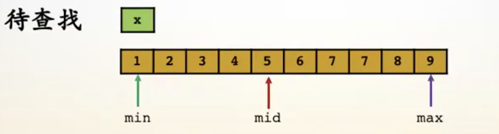
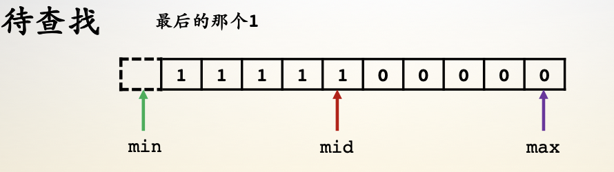
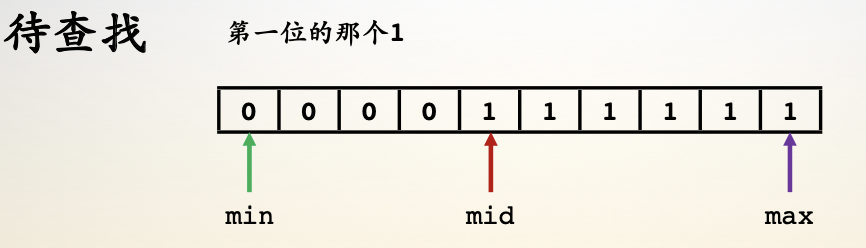
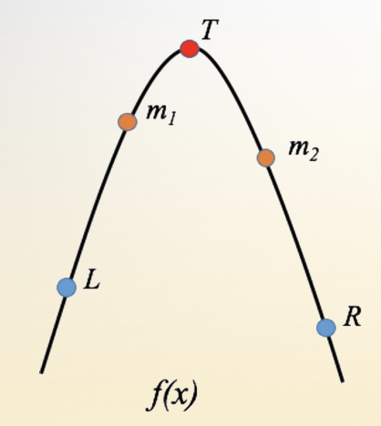

- [1.二分查找](#1二分查找)
- [2.三分查找](#2三分查找)

------

## 1.二分查找

- 正常情况

    - min是头指针；max是尾指针；mid =（min + max）/ 2
    - 终止条件：min  >= max
    - 如果 arr[mid]  <  x, min  =  mid  +  1 
    - 如果 arr[mid]  >  x, max =  mid  +   1
    - 如果 arr[mid]  == x, 找到结果
    - 

- 特殊情况1

    - min 是头指针， max是尾指针；mid =（mid  + max）/  2
    - 如果 arr[mid]  == 1,  min = mid 
    - 如果 arr[mid]  !=  1, max  = mid -   1
    - 如果 min == max，找到结果
    - 

- 特殊情况2

    - min 是头指针， max是尾指针；mid= （mid  + max）/  2
    - 如果 arr[mid] ==  1, min = mid  + 1
    - 如果 arr[mid] !=  1, max = mid - 1
    - 如果 min == max,  找到结果
    - 

- LeetCode35、278、374、378

```c
/*************************************************************************
	> File Name: binary_search.c
	> Author: 
	> Mail: 
	> Created Time: 五  5/24 13:19:52 2019
    二分查找
 ************************************************************************/

#include <stdio.h>

#define P(func) { \
    printf("%s = %d\n", #func, func); \
}

// 1 2 3 4 5 6
int binary_search1(int *num, int n, int x) {
    int head = 0, tail = n - 1, mid;
    while (head <= tail) {
        mid = (head + tail) >> 1;
        if (num[mid] == x) return mid;
        if (num[mid] > x) tail = mid - 1;
        else head = mid + 1;
    }
    return -1;
}

// 111111000000
int binary_search2(int *num, int n) {
    int head = -1, tail = n - 1, mid;
    while (head < tail) {
        mid = (head + tail + 1) >> 1;
        if (num[mid] == 1) head = mid;
        else tail = mid - 1;
    }
    return head;
}

// 00000111111
int binary_search3(int *num, int n) {
    int head = 0, tail = n, mid;
    while (head < tail) {
        mid = (head + tail) >> 1;
        if (num[mid] == 1) tail = mid;
        else head = mid + 1;
    }
    return head == n ? -1 : head;
}

int main() {
    int arr1[10] = {1, 3, 5, 7, 11, 13, 17, 19, 23, 29};
    int arr2[10] = {1, 1, 1, 0, 0, 0, 0, 0, 0, 0};
    int arr3[10] = {0, 0, 0, 0, 0, 0, 1, 1, 1, 1};
    P(binary_search1(arr1, 10, 11));
    P(binary_search2(arr2, 10));
    P(binary_search3(arr3, 10));
    return 0;
}
```


## 2.三分查找

- [ L , R ] 是查找范围
- m1 是  [ L , R ] 的 1 / 3处
- m1 是  [  L , R ] 的 2 / 3处
- 如果 f[m1] < f[m2],  L = m1
- 如果 f[m2] <= f[m1], R = m2
- 如果 |m1 - m2| < exp, 找到结果
- 