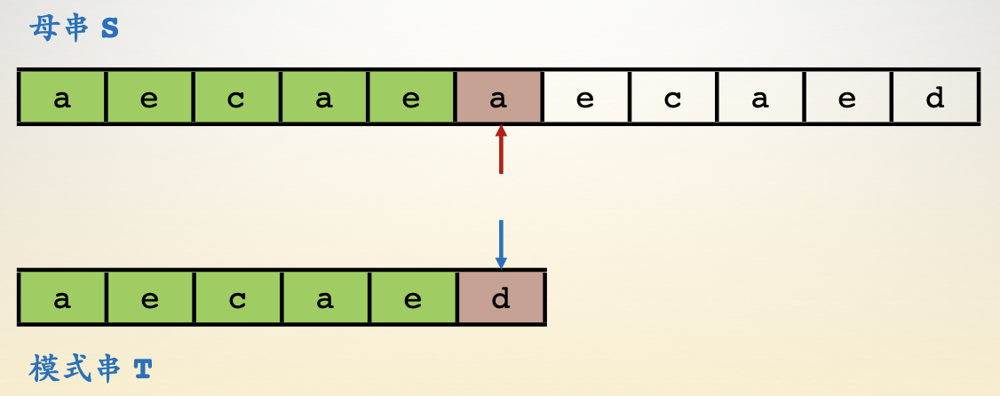
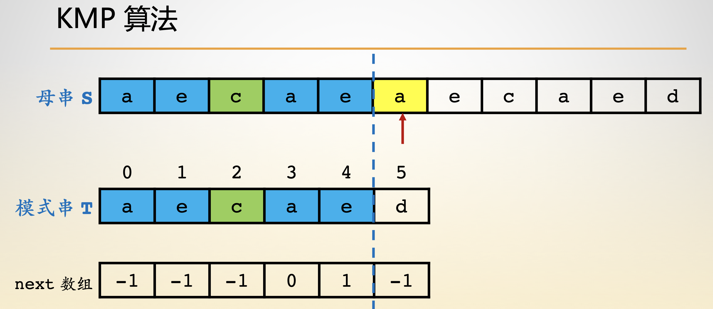
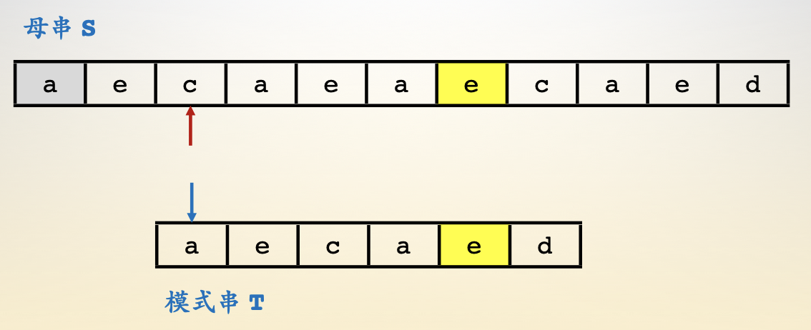
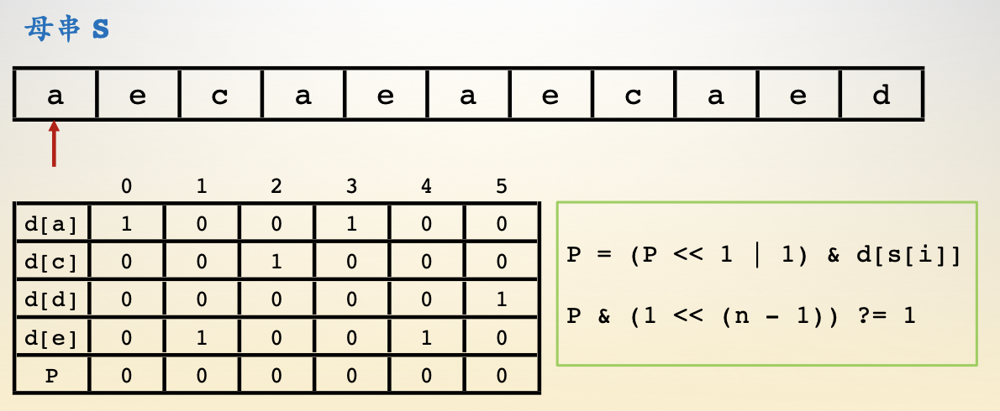
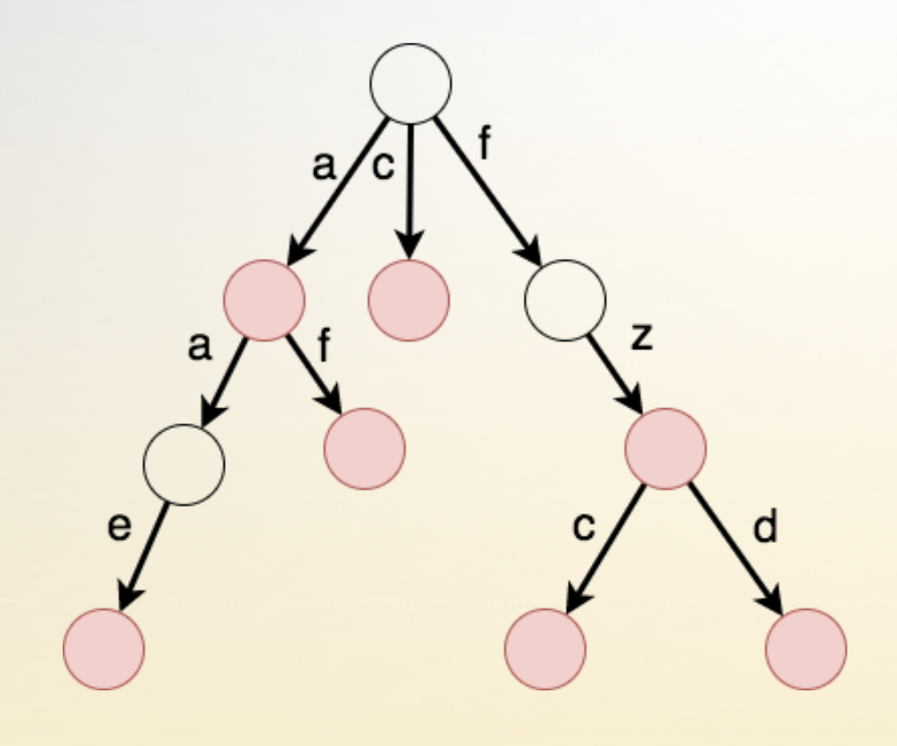
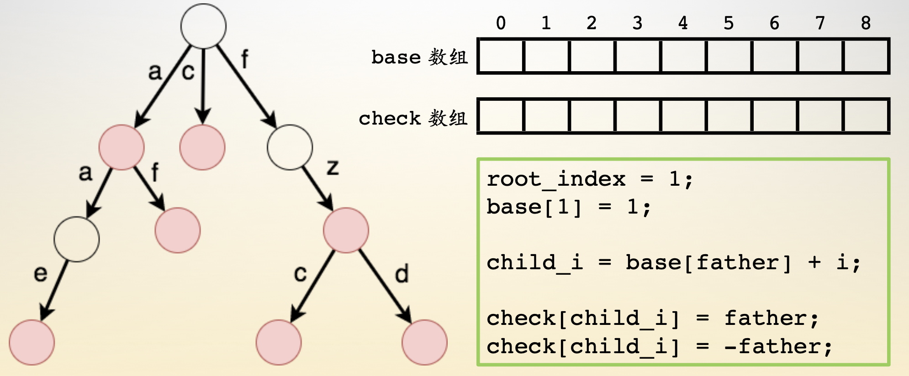
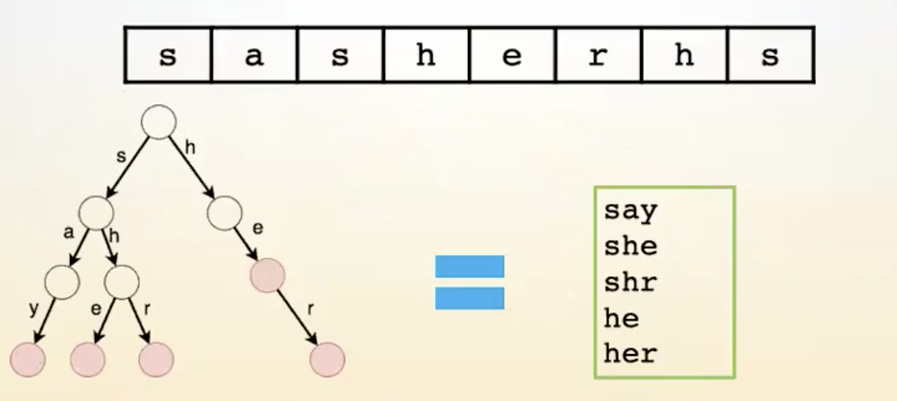

- 字符串
    - [1.暴力算法](#1暴力算法)
    - [2.KMP算法](#2KMP算法)
    - [3.Sunday算法](#3Sunday算法)
    - [4.Shfit-And算法](#4Shfit-And算法)
    - [5.字典树](#5字典树)
    - [6.双数组字典树](#6双数组字典树)
    - [7.AC自动机](#7AC自动机)
    - [8.代码展示](#8代码展示)


------

# 字符串

## 1.暴力算法

- 暴力枚举，时间复杂度O(n * m)
- n 表示母串或文本串元素个数；m  表示模式串元素个数
- 

## 2.KMP算法

- 寻找文本串任意字符所能匹配的模式串的最长前缀，时间复杂度O(n + m)
- n 表示母串或文本串元素个数；m  表示模式串元素个数
- next数组：代表了模式串中互相匹配的子串 【Tb】 对应的 【Ta】 的元素下标。
- 注意：假设模式串最前面又一个虚拟标记 【-1】 它可以匹配所有字符
- 

## 3.Sunday算法

- 最适用与查找文章字符串，时间复杂度O(n / m)
- n 表示母串或文本串元素个数；m  表示模式串元素个数
- 找到文本串中与模式串匹配失效后的下一位元素
- 找到元素在模式串中最后一次出现的位置，进行对齐
- 回到模式串头部进行匹配，如果匹配失效
- 重复上述步骤，直到匹配成功
- 

## 4.Shfit-And算法

- 通过位运算进行状态转换，时间复杂度O(n * m / k),
- n 表示母串或文本串元素个数；m  表示模式串元素个数
- K表示模式串能表示多少位整型
- 数组 d【i】为字符 i 是否出现 0 未出现， 1 出现
- 数组 P【i】的第 i 位为 1 代表母串的第i个元素往前找，能够找到模式串的哪些前缀
- 

## 5.字典树

- 节点是一个集合，边代表关系。 时间复杂度O(n)
- 红色节点代表此集合中有以此前缀为单词的词
- 缺点浪费存储空间
- 

## 6.双数组字典树

- base数组代表父节点记录的孩子的住处，即父节点找子节点
- check数组代表孩子记录的父节点的坐标，即给孩子做亲子鉴定
- check数组为负数代表该节点独立成词
- 

## 7.AC自动机

- 

## 8.代码展示

```c
/*************************************************************************
	> File Name: string.c
	> Author: 
	> Mail: 
	> Created Time: 日  5/12 14:05:22 2019
 ************************************************************************/

#include <stdio.h>
#include <string.h>
#include <stdlib.h>

#define Test(func, a, b) { \
    printf("algorithm : %s = %d\n", #func, func(a, b)); \
}

int brute_force(const char *text, const char *pattern) {
    for (int i = 0; text[i]; i++) {
        int j;
        for (j = 0; pattern[j]; j++) {
            if (text[i + j] != pattern[j]) break;
        }
        if (pattern[j] == 0) return i;
    }
    return -1;
}

int kmp(const char *text, const char *pattern) {
    int len = strlen(pattern);
    int *next = (int *)malloc(sizeof(int) * len);
    next[0] = -1;
    int i, j = next[0];
    for (i = 1; pattern[i]; i++) {
        while (j != -1 && pattern[j + 1] != pattern[i]) j = next[j];
        if (pattern[j + 1] == pattern[i]) j += 1; 
        next[i] = j;
    }
    i = 0, j = -1;
    while (text[i]) {
        while (j != -1 && text[i] != pattern[j + 1]) j = next[j];
        if (text[i] == pattern[j + 1]) j += 1;
        if (pattern[j + 1] == 0) return i - len + 1;
        i += 1;
    }
    return -1;
}

int sunday(const char *text, const char *pattern) {
    int ind[128];
    int len1 = strlen(pattern);
    int len2 = strlen(text);
    for (int i = 0; i < 128; i++) {
        ind[i] = len1 + 1;
    }
    for (int i = 0; pattern[i]; i++) {
        ind[pattern[i]] = len1 - i;
    }
    for (int i = 0; i + len1 <= len2;) {
        int j;
        for (j = 0; j < len1; j++) {
            if (text[i + j] != pattern[j]) {
                i += ind[text[i + len1]];
                break;
            }
        }
        if (j == len1) return i;
    }
    return -1;
}

int shift_and(const char *text, const char *pattern) {
    int code[128] = {0};
    int len = 0;
    for (int i = 0; pattern[i]; i++, len++) {
        code[pattern[i]] |= (1 << i);
    }
    int p = 0;
    for (int i = 0; text[i]; i++) {
        p = (p << 1 | 1) & code[text[i]];
        if (p & (1 << (len - 1))) return i - len + 1;
    }
    return -1;
}

int shift_or(const char *text, const char *pattern) {
    int code[128] = {0};
    memset(code, -1, sizeof(code));
    int len = 0;
    for (int i = 0; pattern[i]; i++, len++){
        code[pattern[i]] &= ~(1 << i);
    }
    int p = -1;
    for (int i = 0; text[i]; i++) {
        p = (p << 1) | code[text[i]];
        if (~p & (1 << (len -1))) return i - len + 1;
    }
    return -1;
}

int main() {
    char str1[1000], str2[1000]; 
    while (~scanf("%s%s", str1, str2)) {
        Test(brute_force, str1, str2);
        Test(kmp, str1, str2);
        Test(sunday, str1, str2);
        Test(shift_and, str1, str2);
        Test(shift_or, str1, str2);
    }
    return 0;
}
```

