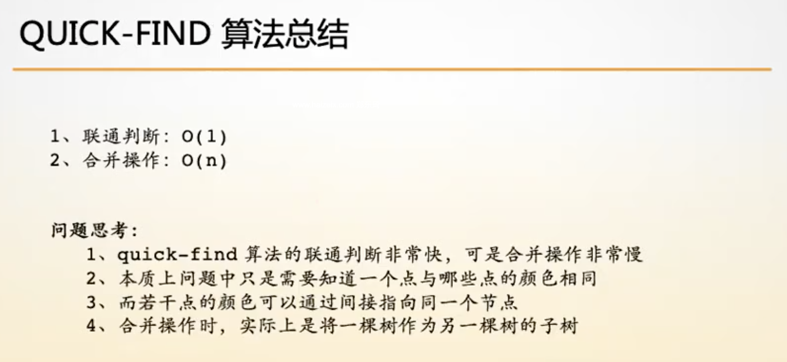
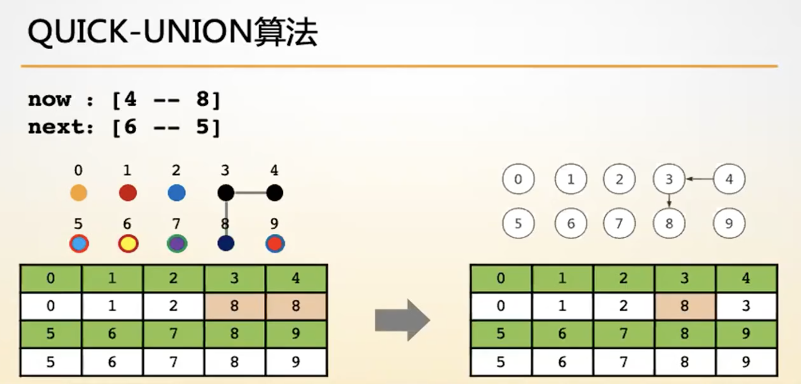
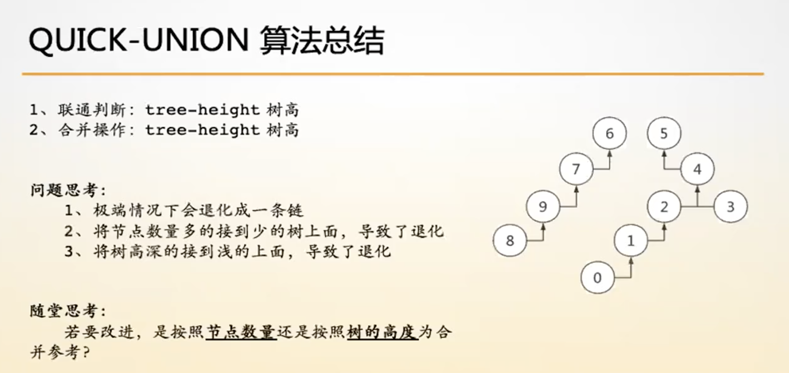
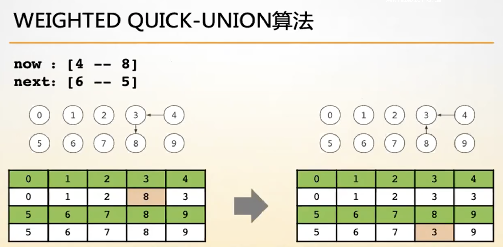
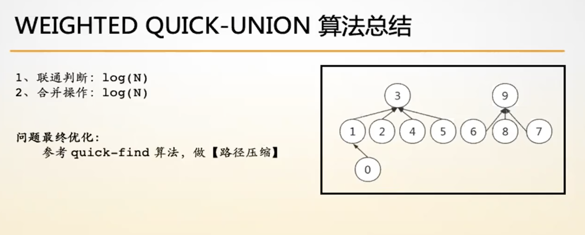

- [Quick_Find](#Quick_Find)
- [Quick_Union](Quick_Union)
- [Weighted_Quick_Union](#Weighted_Quick_Union)
- [Weighted_Quick_Union With Path Compression](#Weighted_Quick_Union With Path Compression)

------

## Quick_Find


- 联通(union)：O(n)、查找(find)：O(1)
- 解决联通性问题

    - 染色思想



```c#
/*************************************************************************
	> File Name: Quick_Find.c
	> Author: 
	> Mail: 
	> Created Time: 五  5/24 13:25:43 2019
 ************************************************************************/

#include <stdio.h>
#include <stdlib.h>

typedef struct UnionSet {
    int *color;
    int n;
} UnionSet;

UnionSet *init(int n) {
    UnionSet *u = (UnionSet *)malloc(sizeof(UnionSet));
    u->color = (int *)malloc(sizeof(int) * (n + 1));
    u->n = n;
    for (int i = 1; i <= n; i++) {
        u->color[i] = i;
    }
    return u;
}

int find(UnionSet *u, int x) {
    return u->color[x];
}

int merge(UnionSet *u, int a, int b) {
    if (find(u, a) == find(u, b)) return 0;
    int color_a = u->color[a];
    for (int i = 1; i <= u->n; i++) {
        if (u->color[i] - color_a) continue;
        u->color[i] = u->color[b];
    }
    return 1;
}

void clear(UnionSet *u) {
    if (u == NULL) return ;
    free(u->color);
    free(u);
    return ;
}

int main() {
    int n, m;
    scanf("%d%d", &n, &m);
    UnionSet *u = init(n);
    for (int i = 0; i < m; i++) {
        int a, b, c;
        scanf("%d%d%d", &a, &b, &c);
        switch (a) {
            case 1: merge(u, b, c); break;
            case 2: printf("%s\n", find(u, b) == find(u, c) ? "Yes" : "No"); break;
        }
    }
    return 0;
}
```


## Quick_Union



- 联通(union)：tree-height、 查找(find)：tree-height



```c
/*************************************************************************
	> File Name: Quick_Union.c
	> Author: 
	> Mail: 
	> Created Time: 五  5/24 13:26:24 2019
    并查集
 ************************************************************************/

#include <stdio.h>
#include <stdlib.h>
#define swap(a, b) { \
    __typeof(a) __temp = a; \
    a = b, b = __temp; \
}

typedef struct UnionSet {
    int *father, *size;
    int n;
} UnionSet;

UnionSet *init(int n) {
    UnionSet *u = (UnionSet *)malloc(sizeof(UnionSet));
    u->father = (int *)malloc(sizeof(int) * (n + 1));
    u->size = (int *)malloc(sizeof(int) * (n + 1));
    u->n = n;
    for (int i = 1; i <= n; i++) {
        u->father[i] = i;
        u->size[i] = 1;
    }
    return u;
}

int find(UnionSet *u, int x) {
    return u->father[x] = (u->father[x] == x ? x : find(u, u->father[x]));
}

int merge(UnionSet *u, int a, int b) {
    int fa = find(u, a), fb = find(u, b);
    if (fa == fb) return 0;
    if (u->size[fa] > u->size[fb]) swap(fa, fb);
    u->father[fa] = fb;
    u->size[fb] += u->size[fa];
    return 1;
}

void clear(UnionSet *u) {
    if (u == NULL) return ;
    free(u->father);
    free(u->size);
    free(u);
    return ;
}

int main() {
    int n, m;
    scanf("%d%d", &n, &m);
    UnionSet *u = init(n);
    for (int i = 0; i < m; i++) {
        int a, b, c;
        scanf("%d%d%d", &a, &b, &c);
        switch (a) {
            case 1: merge(u, b, c); break;
            case 2: printf("%s\n", find(u, b) == find(u, c) ? "Yes" : "No"); break;
        }
    }
    clear(u);
    return 0;
}
```


## Weighted_Quick_Union



- 联通(union)：O(logn)、查找(find)：O(logn)
- 按秩优化

## Weighted_Quick_Union With Path Compression



- 联通(union)：O(1)、查找(find)：O(1)
- 路径压缩