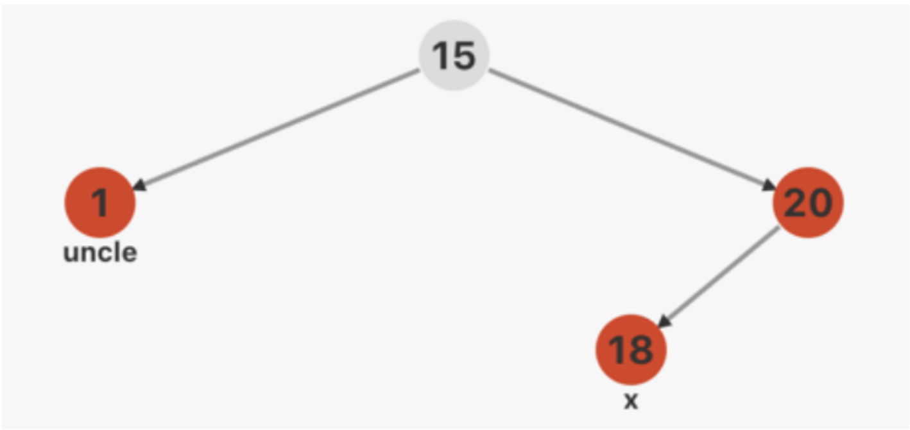
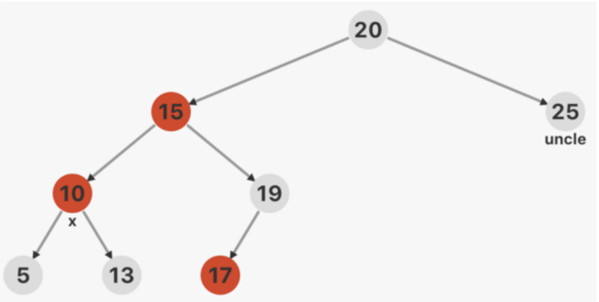
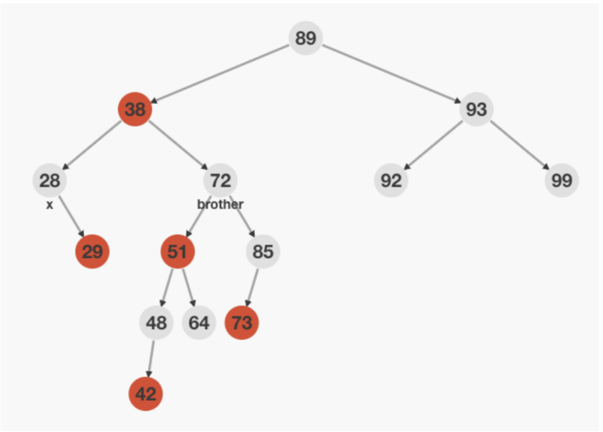
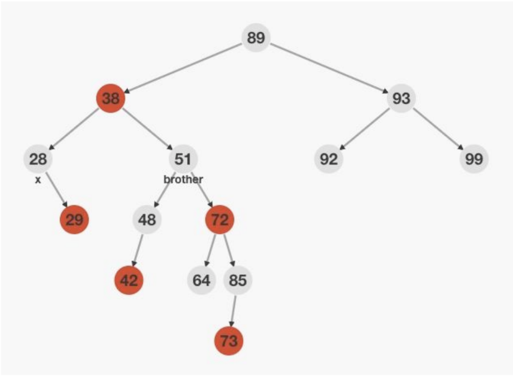

# 红黑树总结

## 五个条件

1. 每个节点非黑即红
2. 根结点是黑色
3. 叶子节点（nil）是黑色
4. 如果一个节点是红色，则它的两个子节点都是黑色的
5. 从根节点出发到所有叶子节点路径上，黑色节点数量相同

## 调整策略

1. 插入调整站在祖父节点看
2. 删除调整站在父节点看
3. 插入和删除的情况处理一共五种

## 插入调整情况

- 情况一

    

    - 处理办法：1和20修改成黑色，15修改成红色(所谓的红色上顶)

- 情况二

    

    - 处理办法：大右（左）旋，20调整成红色，15调整成褐色，即可
    - 其它情况均可调整成情况二处理

## 删除调整情况

- 情况一

    

    - 处理情况：brother调整为红色，x减少一重黑色，father增加一种黑色

- 情况二

    

    - 处理办法：brother右（左）旋，51变黑，72变红，转成处理情况三

- 情况三

    
    - 处理办法：father左（右）旋，由于无法确定48的颜色，所以38改成黑色，51改成38的颜色，x减少一重黑色，72改成黑色